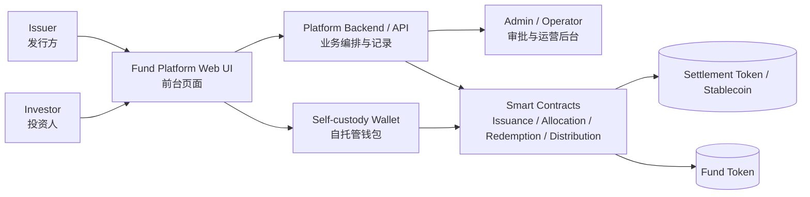
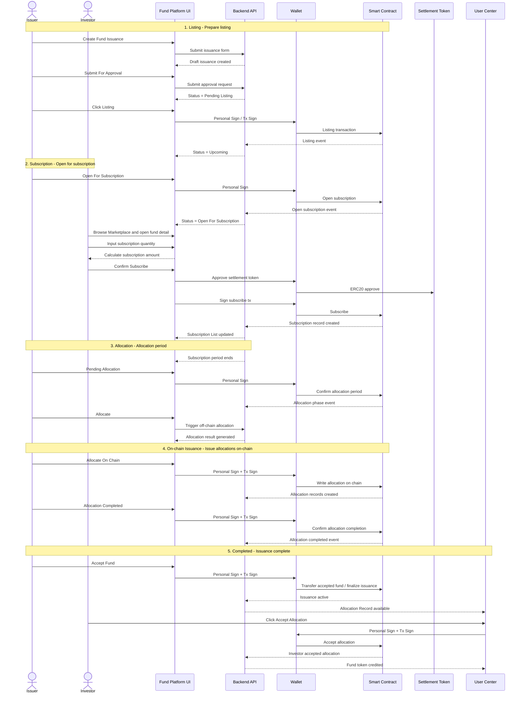
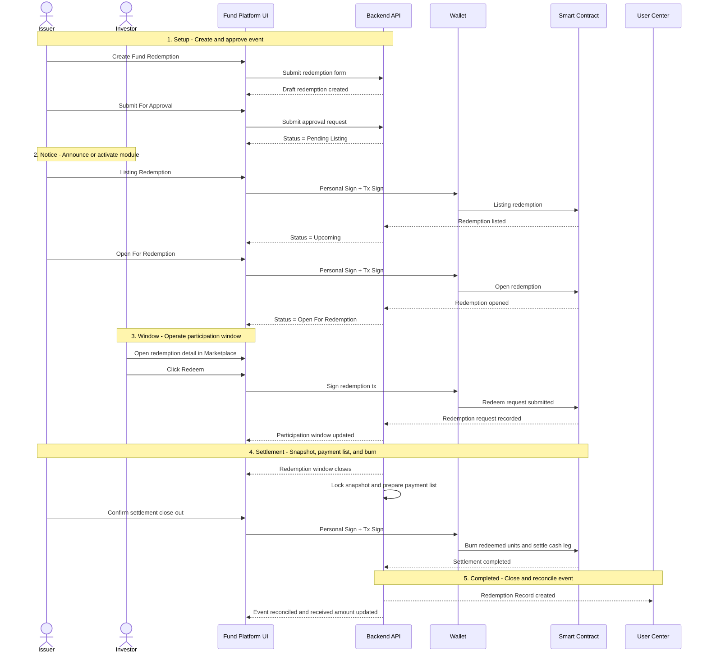
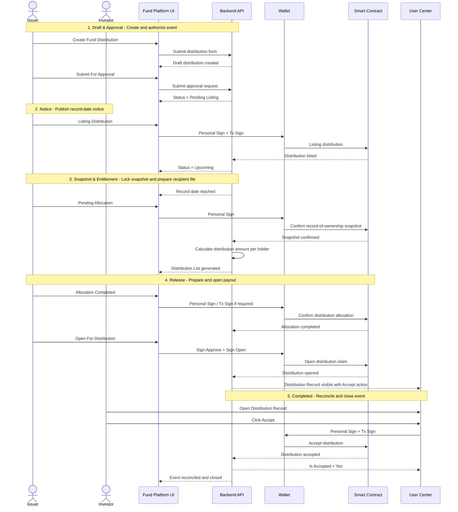

# TICKET：Fund RWA 发行平台 — 全流程 UI

> ⚠️ **已废弃 — 请参考 `Fund-Platform-Full-Ticket-v2.md`（v2.0 审计修订版）**
> 本 Ticket A 由 2026-04-16 审计报告审查，发现 Bond 衍生架构错误，已于 F1/F2/F3 判定为 **拒绝全量开发**。
> **请勿基于本文件开始开发。**

**类型：** Feature（已废弃）
**优先级：** P0
**版本：** v1.0（已废弃）
**角色覆盖：** Issuer（发行方）+ Investor（投资人）  
**钱包方案：** 自托管钱包（无需实现内嵌钱包 UI，右侧钱包面板不在本 Ticket 范围内）

***

## 背景与目标

在现有 Bond RWA 发行平台基础上，**新建一套完整的 Fund（基金）RWA 发行平台**，供 Issuer 发行基金份额代币、供 Investor 认购及领取分配。  

整体流程沿用现有平台框架与交互模式，页面布局复用既有结构（顶部导航 + 左侧 Manage 菜单 + 主内容区）：

```
Listing Fund  →  Subscription Period  →  Allocation Period  →  Issuance & Accept Fund  →  Accept Allocation
```

***

## 范围说明

本文件基于以下材料整理并改写：
- `WeBank Web3_Bond-0319-v2.pptx` 中的产品背景、平台能力与三条业务流程定义
- 三个 demo 流程视频及其导出的逐秒截图 / PDF
- 现有 `Issuance` 参考文档

本 Ticket **仅覆盖三条前台业务流程的 Fund 化改写**：
- Fund Issuance / Subscription
- Fund Redemption
- Fund Distribution

本 Ticket **不覆盖** 下列平台级能力的详细设计：
- Operator / Custodian / Issuer Agent 等后台角色工作台
- Settlement Token 的 mint / burn 与清结算底座
- Secondary DVP / FOP / 二级市场交易模块
- Reconciliation、审计后台、集成层等平台能力
- KYB / KYC / 多语言 / 隐私增强等通用基础设施能力

如需扩展为整个平台 PRD，应基于 `PPT` 的平台能力页另开独立章节或独立 Ticket。

***

## 一、导航菜单

### 1.1 顶部导航

保持现有三个主菜单：`Create` | `Manage` | `Marketplace`

### 1.2 Create 下拉菜单 — 新增项

| 新增菜单项 |
|---|
| Create Fund Issuance |
| Create Fund Redemption |
| Create Fund Distribution |

### 1.3 Manage 下拉菜单 — 新增项

| 新增菜单项 |
|---|
| Manage Fund Issuance |
| Manage Fund Redemption |
| Manage Fund Distribution |

***

## 二、Create Fund Issuance 表单页

**路由：** `/create/fund-issuance`  
**页面标题：** `Create Fund Issuance`  
**进度步骤条（顶部横向）：**

```
About Deal  |  About Token  |  Subscription & Rules  |  Fund Documents  |  Fee Charge
```

每个 Tab 填写完毕后点击 `Next` 进入下一步；任意步骤可点击 Tab 标题跳回。最后一步显示 `Create` 按钮。

***

### 2.1 Tab 1：About Deal

> 所有标 `*` 的字段为必填。

| 字段名 | 控件类型 | 必填 | 备注 |
|---|---|---|---|
| `* Fund name` | Text input | ✅ | 基金全称 |
| `* Fund description` | Textarea | ✅ | 基金简介 |
| `* Fund type` | Dropdown | ✅ | 选项：`Open-end`（开放式） / `Closed-end`（封闭式） |
| `* Deal size unit` | Dropdown | ✅ | 计价货币，如 `Bean` / `USDC` |
| `* Target fund size` | Number input + unit label | ✅ | 募集目标总金额，如 `1,000,000 Bean` |
| `* Minimum subscription amount` | Number input + unit label | ✅ | 单笔最低认购金额 |
| `* Maximum subscription amount per investor` | Number input + unit label | ✅ | 单个投资人上限 |
| `* Initial subscription price` | Number input + unit label | ✅ | 每份额初始认购价（即初始 NAV）|
| `* Management fee (% p.a.)` | Number input + `%` suffix | ✅ | 年化管理费率，如 `1.5` |
| `Performance fee (%)` | Number input + `%` suffix | ❌ 可选 | 超额收益提成比例 |
| `* Investment strategy` | Textarea | ✅ | 基金投资策略说明 |
| `* Fund manager` | Text input | ✅ | 基金管理人名称或机构名 |
| `* Redemption frequency` | Dropdown | ✅ | 选项：`Daily` / `Weekly` / `Monthly` / `Quarterly` / `None` |
| `Redemption notice period (days)` | Number input | ❌ 可选 | 赎回提前通知天数 |
| `Lock-up period` | Duration picker | ❌ 可选 | 封闭期，格式：`X Days / Months / Years`；当 Fund type = `Open-end` 时可留空 |
| `* Issue date` | Date + Time picker | ✅ | 基金成立日期，沿用现有平台日期选择器样式 |
| `Maturity date` | Date + Time picker | ❌ 条件显示 | **仅当 Fund type = `Closed-end` 时展示此字段**；Open-end 隐藏 |
| `References` | 动态列表 | ❌ 可选 | 每条可选 `File`（上传，Max 1 file per item）或 `Link`（输入 URL）；可 `+ Add Reference`，每条有 `X` 删除按钮 |

**字段交互规则：**
- 当 `Fund type` 切换为 `Closed-end` 时，动态插入 `Maturity date` 字段（在 `Issue date` 下方）。
- 当 `Fund type` 切换为 `Open-end` 时，`Maturity date` 字段隐藏，已填写的值清空。

***

### 2.2 Tab 2：About Token

| 字段名 | 控件类型 | 必填 | 备注 |
|---|---|---|---|
| `* Name of fund token` | Text input | ✅ | 基金代币全称，如 `DEMO-FUND-2024` |
| `* Symbol of fund token (limit in 15 letters)` | Text input | ✅ | 代币 Ticker，最多 15 字符 |
| `* Is token tradable on secondary market` | Toggle: `Yes` / `No` | ✅ | 是否支持二级市场流通 |

***

### 2.3 Tab 3：Subscription & Rules

| 字段名 | 控件类型 | 必填 | 备注 |
|---|---|---|---|
| `* Subscription lot size` | Number input | ✅ | 认购单位份额数 |
| `* Subscription minimum quantity` | Number input | ✅ | 最小认购数量（单位：lot） |
| `* Subscription maximum quantity` | Number input | ✅ | 最大认购数量 |
| `* Subscription period` | Date range picker | ✅ | 认购开始时间 ~ 认购结束时间，沿用现有平台日期时间选择器样式（分钟/秒滚轮） |
| `* Allocation rule` | Dropdown | ✅ | 选项：`Pro-rata`（按比例，默认）/ `First-come-first-served`（先到先得）；**不含 Lottery 选项** |
| `Investor rules` | 动态规则列表 | ❌ 可选 | 每条规则包含：`* Investor rules type`（Dropdown：`Investor type` / `Investor jurisdiction`）+ `* Condition Type`（`Must be`）+ 对应值（`All investors` / `All Jurisdictions` 等）；可 `+ Add Rule` 添加，每条有删除按钮 |

***

### 2.4 Tab 4：Fund Documents

> 沿用现有平台的资产托管资料页结构，并改写为 Fund 语义。

| 字段名 | 控件类型 | 必填 | 备注 |
|---|---|---|---|
| `* Fund administrator` | Text input | ✅ | 基金行政管理人名称 |
| `* Custodian of fund assets` | Text input | ✅ | 资产托管机构名称 |
| `Custodian contact number` | Text input | ❌ 可选 | 托管方联系方式 |
| `* Upload: Fund offering document / Prospectus` | File upload button | ✅ | 募集说明书，支持 PDF；单文件；必传 |
| `Upload: Fund fact sheet` | File upload button | ❌ 可选 | 基金概要说明书，支持 PDF |
| `Upload: Other supporting documents` | Multi-file upload | ❌ 可选 | 文件类型：JPG / PNG / GIF / PDF；单文件 max 500MB；可多个 |

***

### 2.5 Tab 5：Fee Charge

展示平台佣金说明文本（纯文本展示，不含输入字段），内容示例：

> We normally charge issuer the fund subscription amount(s) subject to listing, in [unit] as commission fee. If issuer terminates this fund issuance application after listing, the commission fee is not refundable.  
> The commission fee will be charged once upon listing the deal. For any query about the commission fee, you can contact us at [contact email].

***

### 2.6 表单提交

点击 `Create` 按钮后：
- 若成功：弹出全屏成功提示页
  - 标题：`Create fund issuance successfully`
  - 副文：`You can click to view fund deal detail page.`
  - 按钮：`View Detail`（跳转至 Fund Issuance Detail 页，初始状态 `Draft`）
- 若失败：Toast 错误提示

***

## 三、Manage Fund Issuance 列表页

**路由：** `/manage/fund-issuance`  
**页面标题：** `Fund Issuance List`

列表表格列定义：

| 列名 | 说明 |
|---|---|
| ID | 记录 ID（可点击 Copy） |
| Asset Type | 固定值 `Fund` |
| Status | 当前状态 Badge（见第六节状态机） |
| Allocation Status | `Upcoming` / `Ongoing` / `Put On Chain` / `Unknown` |
| Name | 基金名称 |
| Description | 基金描述 |
| Action | `Copy`（复制 ID）|
| Created Time | 创建时间，格式 `YYYY-MM-DD HH:mm:ss` |

***

## 四、Fund Issuance Detail 页（Issuer 视角）

**路由：** `/fund-issuance/{id}`  
**适用角色：** Issuer（Manage 路径）和 Investor（Marketplace 路径，只读）

***

### 4.1 页面头部

```
{Fund Name}    [{Status Badge}]

[{操作按钮组，按状态显示}]
```

### 4.2 Tab 导航

```
Overview  |  Information  |  Subscription  |  Allocation
```

> Fund 版本不包含独立的 `Coupon Data` Tab。

***

### 4.3 Information Panel（左侧信息面板）

> 所有字段只读展示。上链前 Token Contract Address 显示 `–`；上链后显示完整地址 + `Copy` 按钮。

| 字段名 | 显示示例 |
|---|---|
| Fund Token | `DEMO-FUND-2024` |
| Token Contract Address | `0xa7E4...cb120`（含 Copy 按钮）/ `–` |
| Asset Type | `Fund` |
| Min Subscription Amount | `1 Bean` |
| Max Subscription Amount | `1,000 Bean` |
| Initial NAV / Issue Price | `90 Bean` |
| Fund Type | `Open-end` / `Closed-end` |
| Management Fee | `1.5% p.a.` |
| Performance Fee | `10%` / `N/A` |
| Redemption Frequency | `Monthly` |
| Lock-up Period | `90 Days` / `None` |
| Tradable | `Yes` / `No` |
| Fund Manager | `{管理人名称}` |
| Target Fund Size | `1,000,000 Bean` |

> Fund 版本不展示下列固定收益产品字段：~~Redemption Price~~、~~Yield to Maturity~~、~~Tenor~~

***

### 4.4 Timeline Panel（右侧时间轴）

| 时间节点                    | 格式                                                              |
| ----------------------- | --------------------------------------------------------------- |
| Subscription Start Date | `YYYY-MM-DD HH:mm:ss` + 倒计时 `X Hour(s) X Minute(s) X Second(s)` |
| Subscription End Date   | 同上                                                              |
| Issue Date              | 同上                                                              |
| Maturity Date           | **仅 Closed-end Fund 显示**；Open-end 隐藏此行                          |

***

### 4.5 Subscription Tab 内容

**Subscription Summary（汇总卡片）：**

| 字段 | 说明 |
|---|---|
| Target Fund Size | 募集目标总金额 |
| Subscribed Amount | 已认购金额 |
| Received Amount | 已收款金额（Bean） |
| Remaining Amount | 剩余可认购金额 |

**Subscription List（认购明细表）：**

| 列名 | 说明 |
|---|---|
| ID | 认购记录 ID |
| Status | `Live` / `Pending` / `Done` |
| Issue Price | 认购单价 |
| Quantity | 认购数量 |
| Total Amount | 认购总金额 |
| Subscribe Time | 认购时间 |
| Updated Time | 最后更新时间 |

***

### 4.6 Allocation Tab 内容

**Allocation Summary（汇总卡片）：**

| 字段 | 说明 |
|---|---|
| Allocated Total Amount | 已分配总份额数 |
| Allocated Investors | 已分配投资人数量 |
| Reserved Fund Amount | 预留资金总额（Bean） |

**Allocation List（分配明细表）：**

| 列名 | 说明 |
|---|---|
| ID | 分配记录 ID |
| Status | `Pending` / `Done` |
| Quantity | 分配份额数量 |
| Is Accepted | `Yes` / `No` |
| Allocate Time | 分配时间 |
| Updated Time | 最后更新时间 |

***

## 五、Issuer 操作 Modal 全集

所有 Modal 采用统一三步进度条设计：

```
① Start  →  ② Sign  →  ③ [操作名 Completed / Executed]
```

进度条每步含圆形步骤编号 + 步骤标签；当前步骤高亮，已完成步骤打勾。

***

### 5.1 Submit For Approval Modal

触发：Detail 页 `Submit For Approval` 按钮点击  
**弹窗内容：**
- 标题：`Submit For Approval`
- 正文：`Confirmation — Are you sure you want to submit this deal for approval?`
- 按钮：`Cancel`（关闭）| `Confirm`（确认提交）
- 成功提示页：`Submit fund issuance successfully. You can click to view fund deal page.` + `View Detail` 按钮

***

### 5.2 Listing Modal（三步）

触发：管理员审批通过后，Detail 页出现 `Listing` 按钮

**Step 1 — Start：**
- 展示 Fund 信息摘要（Fund name、Token address、Target fund size、Issue date、Subscription period 等）
- 提示文案：`You need to sign transaction for listing via your wallet.`
- 按钮：`Start`

**Step 2 — Personal Sign：**
- 弹出签名请求框
- 标题：`Personal Sign`
- 副文：`Please personal sign to proceed`
- 底部调用自托管钱包，等待签名响应

**Step 3 — 完成：**
- `!` 图标 + `Listing deal has been executed`
- 副文：`You can go to Inbox page to view your request.`
- 按钮：`Goto Inbox`

***

### 5.3 Open For Subscription Modal（三步）

触发：Detail 页状态到达 `Upcoming`，`Open For Subscription` 按钮出现

**Step 1 — Start：**
- 提示：`You need to sign transaction for open for subscription via your wallet.`
- 按钮：`Sign`

**Step 2 — Personal Sign：**
- 同 5.2 Step 2

**Step 3 — 完成：**
- `Open for subscription has been executed. You can go to Inbox page to view your request.` + `Goto Inbox`

***

### 5.4 Pending Allocation Modal（三步）

触发：订阅期结束后，Issuer 点击 `Pending Allocation`

**Step 1 — Start：**
- 展示当前认购汇总信息
- 提示：`You are going to proceed to pending allocation.`
- 按钮：`Start`

**Step 2 — Personal Sign：**
- 同 5.2 Step 2

**Step 3 — 完成：**
- `Pending allocation has been executed. You can go to Inbox page to view your request.` + `Goto Inbox`

***

### 5.5 Allocate Deal（链下计算，无 Modal）

触发：Pending Allocation 完成后，Issuer 点击 `Allocate` 按钮  
- 系统后台执行链下分配计算（Pro-rata 或 First-come-first-served）
- 完成后 Toast 提示：`Allocate deal has been executed. You can go to Inbox page to view your request.`
- Allocation List 出现各投资人的分配条目，状态为 `Pending`，`Is Accepted = No`

***

### 5.6 Allocate On Chain Modal（三步）

触发：链下计算完成后，Issuer 点击 `Allocate On Chain`

**Step 1 — Start：**
- 提示：`You need to sign transaction for on-chain allocation via your wallet.`
- 按钮：`Start`

**Step 2 — Sign（两步签名）：**
- 先：`Personal Sign — Please personal sign to proceed`（自托管钱包 Personal Sign）
- 后：`Sign Transaction — Please verify the smart contract call`（ERC-20 approve + 链上 allocate call）

**Step 3 — 完成：**
- `Allocation on chain has been executed. You can go to Inbox page to view your request.` + `Goto Inbox`

***

### 5.7 Allocation Completed Modal（三步）

触发：On Chain 成功后，Issuer 点击 `Allocation Completed`

**Step 1 — Start：**
- 提示文案 + `Start` 按钮

**Step 2 — Sign（两步签名）：**
- Personal Sign + Transaction Sign（同 5.6）

**Step 3 — 完成：**
- `Allocation completed has been executed. You can go to Inbox page to view your request.` + `Goto Inbox`

***

### 5.8 Accept Fund Modal（三步）

触发：状态达到 `Issuance Completed`，Issuer 点击 `Accept Fund`

**Step 1 — Start：**
- 提示：`You need to sign transaction for accepting fund via your wallet.`
- 按钮：`Start`

**Step 2 — Sign：**
- Personal Sign + Transaction Sign

**Step 3 — 完成：**
- `Accept fund has been executed. You can go to Inbox page to view your request.` + `Goto Inbox`
- 状态更新为 `Issuance Active`（基金运营中）

***

## 六、Issuer 侧状态机

```
Draft
  │ 点击 Submit For Approval → 弹 Confirm Modal
  ▼
Pending Listing
  │ Cancel Deal Listing（可取消）
  │ 审批通过 → Listing Modal（Personal Sign + Tx Sign）
  ▼
Upcoming
  │ 自动（到达 Subscription Start Date）或 Issuer 点击 Open For Subscription
  ▼
Open For Subscription
  │ 自动（到达 Subscription End Date）
  ▼
Allocation Period  [Pending Allocation]
  │ Issuer → Pending Allocation Modal（Personal Sign）
  ▼
Calculated  [Allocate Deal]
  │ Issuer → 点击 Allocate（链下计算，无 Modal）
  ▼
Allocate On Chain
  │ Issuer → Allocate On Chain Modal（Personal Sign + Tx Sign）
  ▼
Allocation Completed
  │ Issuer → Allocation Completed Modal（Personal Sign + Tx Sign）
  ▼
Issuance Completed
  │ Issuer → Accept Fund Modal（Personal Sign + Tx Sign）
  ▼
Issuance Active（基金运营中，Open-end 无终止；Closed-end 见待澄清 Q1）
```

**各状态对应操作按钮（仅列出该状态下可点击项）：**

| 状态 | 显示按钮 |
|---|---|
| Draft | `Edit` + `Submit For Approval` |
| Pending Listing | `Cancel Deal Listing` + `Listing`（Admin 操作） |
| Upcoming | `Open in Explorer` |
| Open For Subscription | — |
| Allocation Period | `Pending Allocation` |
| Calculated | `Allocate` |
| Allocate On Chain | `Allocate On Chain` |
| Allocation Completed | `Allocation Completed` |
| Issuance Completed | `Accept Fund` |
| Issuance Active | — |

***

## 七、Marketplace — 基金列表页（Investor 视角）

**路由：** `/marketplace/fund-issuance`

页面包含一个列表区块 `Fund Issuance List`，表格列：

| 列名 | 说明 |
|---|---|
| ID | 记录 ID |
| Name | 基金名称 |
| Description | 基金描述 |
| Asset Type | `Fund` |
| Status | 当前状态 Badge |

点击任意行进入 Fund Issuance Detail 页（Investor 只读视角，同第四节，无操作按钮）。  
当状态为 `Open For Subscription` 时，Detail 页右上角出现 `Subscribe` 按钮。

***

## 八、Subscribe Modal（Investor 认购，四步）

触发：Investor 在 Marketplace Detail 页点击 `Subscribe`

```
① Start  →  ② Sign Approve  →  ③ Sign Subscribe  →  ④ Subscribe（完成）
```

**Modal 内信息展示区（只读）：**

| 字段名 | 说明 |
|---|---|
| Fund Name | 基金名称 |
| Token Contract Address | `–` / `0x...` |
| Asset Type | `Fund` |
| Initial NAV / Issue Price | 当前认购单价 |
| Subscription lot size | 认购单位 |
| Subscription minimum quantity | 最小数量 |
| Subscription maximum quantity | 最大数量 |

**Investor 输入区：**

| 字段名 | 控件 | 说明 |
|---|---|---|
| `Subscription quantity` | Number input | Investor 手动输入认购数量 |
| `Subscription amount` | 只读，自动计算 | = quantity × Issue Price，实时更新显示 |

**`Subscribe` 按钮** → 进入步骤流：

**Step 2 — Sign Approve（ERC-20 Approve）：**
- 提示：`Please personal sign to proceed`（Personal Sign）

**Step 3 — Sign Subscribe（链上认购）：**
- 提示：`Please verify the smart contract call`（Transaction Sign）
- DApp 标识：`Tokenization Platform Asset`

**Step 4 — 完成：**
- 关闭 Modal，页面刷新，Subscription List 出现该条认购记录，Status = `Live`

***

## 九、User 个人中心（`/user`）

### 9.1 Tab 列表

| Tab 名称 | 说明 |
|---|---|
| Info | 个人信息 |
| Issued Token Record | 已发行代币记录 |
| Subscribed Deal Record | 已认购产品汇总 |
| Subscription Record | 逐条认购记录 |
| Allocation Record | 分配记录（含 Accept 入口） |
| Refund Record | 退款记录 |
| Redemption Record | 基金赎回到账记录 |
| Distribution Record | 基金分配 / 收益领取记录（含 Accept 入口） |

***

### 9.2 Allocation Record Tab 详细设计

**表格列：**

| 列名 | 说明 |
|---|---|
| ID | 分配记录 UUID |
| Deal ID | 对应基金发行 ID |
| Status | `Success` / `Pending` / `Failed` |
| Quantity | 分配份额数量 |
| Is Accepted | `Yes` / `No` |
| Action | 当 `Is Accepted = No` 且 `Status = Success` 时，显示 **`Accept`** 按钮；否则为空 |
| Allocate Time | 分配时间，格式 `YYYY-MM-DD HH:mm:ss` |

***

### 9.3 Accept Allocation Modal（三步）

触发：Investor 在 Allocation Record 中点击 `Accept` 按钮

```
① Start  →  ② Personal Sign  →  ③ Transaction Sign  →  完成
```

**Step 1 — Start：**
- 展示该条分配信息：Deal ID、分配数量、分配时间
- 按钮：`Start`

**Step 2 — Personal Sign：**
- 标题：`Personal Sign`
- 副文：`Please personal sign to proceed`
- 调用自托管钱包，等待签名

**Step 3 — Transaction Sign：**
- 标题：`Sign Transaction`
- 副文：`Please verify the smart contract call`
- DApp 标识：`Tokenization Platform Asset`
- 合约地址：`0x...`（链上分配合约）

**完成后：**
- `Accept allocation has been executed.`
- 该条记录的 `Is Accepted` 更新为 `Yes`，`Action` 列按钮消失
- 投资人钱包中出现对应份额代币

***

### 9.4 Redemption Record Tab 详细设计

> 参考 `TP_Redemption_Process.mp4` 末尾的 User 页面。该 Tab 为**到账记录**，不含额外交互按钮。

**表格列：**

| 列名 | 说明 |
|---|---|
| ID | 赎回记录 UUID |
| Deal ID | 对应基金赎回 ID |
| Status | `Done` / `Pending` / `Failed` |
| Redemption Amount | 本次赎回总金额 |
| Commission Amount | 平台佣金 |
| Received Amount | 投资人实际到账金额 |
| Redemption Time | 赎回完成时间 |

**交互规则：**
- 本 Tab 不展示 `Accept` 按钮。
- 赎回完成后，记录直接落入该表，`Status = Done`。
- `Received Amount = Redemption Amount - Commission Amount`。

***

### 9.5 Distribution Record Tab 详细设计

> 参考 `TP_Coupon_Distribution_Process.mp4` 末尾的 User 页面。Fund 版本统一使用 `Distribution Record` 命名。

| 列名 | 说明 |
|---|---|
| ID | 分配记录 UUID |
| Deal ID | 对应基金分配 ID |
| Status | `Done` / `Pending` |
| Distribution Amount | 本次收益分配总金额 |
| Commission Amount | 平台佣金 |
| Received Amount | 投资人实际到账 |
| Is Accepted | `Yes` / `No` |
| Action | `Accept`（未领取时显示） |
| Distribution Time | 分配时间 |

**交互规则：**
- 当 `Is Accepted = No` 且 `Status = Done` 时，显示 `Accept` 按钮。
- 当 Investor 完成领取后，`Is Accepted` 更新为 `Yes`，`Action` 按钮消失。
- 领取完成后，资金到账投资人钱包；是否同步更新资金明细，由后端既有记账逻辑决定。

***

## 十、Investor 侧状态流（用户可感知）

```
[Marketplace] 看到 Fund — Status: Upcoming
      ↓（时间到达 Subscription Start Date）
Status: Open For Subscription  →  出现 Subscribe 按钮
      ↓ 投资人认购（Subscribe Modal 四步）
认购记录出现在 User → Subscription Record Tab（Status: Live）
      ↓（Subscription End Date 到达，系统/Issuer 进入 Allocation Period）
等待 Issuer 分配（无 Investor 操作）
      ↓（Issuer 完成 Allocate On Chain + Allocation Completed）
User → Allocation Record Tab 出现条目（Is Accepted: No，显示 Accept 按钮）
      ↓ 投资人点击 Accept（Accept Allocation Modal 三步）
Is Accepted: Yes → 份额代币到账钱包
```

***

## 十一、自托管钱包集成点汇总

| 触发操作 | 签名类型 | 触发方 | 步骤说明 |
|---|---|---|---|
| Listing | Personal Sign | Issuer | Step 2 |
| Open For Subscription | Personal Sign | Issuer | Step 2 |
| Pending Allocation | Personal Sign | Issuer | Step 2 |
| Allocate On Chain | Personal Sign + Transaction Sign | Issuer | Step 2（两次签名） |
| Allocation Completed | Personal Sign + Transaction Sign | Issuer | Step 2（两次签名） |
| Accept Fund | Personal Sign + Transaction Sign | Issuer | Step 2（两次签名） |
| Subscribe — ERC-20 Approve | Transaction Sign | Investor | Step 2 |
| Subscribe — 链上认购 | Transaction Sign | Investor | Step 3 |
| Accept Allocation — Personal Sign | Personal Sign | Investor | Step 2 |
| Accept Allocation — 链上 Accept | Transaction Sign | Investor | Step 3 |
| Listing Redemption | Personal Sign + Transaction Sign | Issuer | Redemption Listing Modal |
| Open For Redemption | Personal Sign + Transaction Sign | Issuer | Open For Redemption Modal |
| Redeem | Transaction Sign | Investor | Redemption 发起赎回 |
| Listing Distribution | Personal Sign + Transaction Sign | Issuer | Distribution Listing Modal |
| Pending Allocation（Record of Ownership） | Personal Sign | Issuer | Distribution 快照确认 |
| Open For Distribution | Personal Sign + Transaction Sign | Issuer | Open For Distribution Modal |
| Accept Distribution — Personal Sign | Personal Sign | Investor | Distribution Accept Step 2 |
| Accept Distribution — 链上 Accept | Transaction Sign | Investor | Distribution Accept Step 2 |

***

## 十二、待澄清问题

| # | 问题 | 影响范围 | 优先级 |
|---|---|---|---|
| Q1 | Closed-end Fund 到期后是否有单独的清算（Liquidation）流程？还是复用 Redemption？ | 状态机 / 后续模块 | 高 |
| Q2 | Edit 功能在 `Pending Listing` 状态下哪些字段可编辑？是否全字段可编辑？ | Create Form / Detail Page | 高 |
| Q3 | Subscription Summary 中是否对所有 Marketplace 访客可见（包括未认购用户）？还是只有认购过的投资人才可见？ | Marketplace Detail Page | 中 |
| Q4 | `Allocation rule = First-come-first-served` 时，超额认购如何处理退款？是否自动退款还是需要 Issuer 手动操作？ | Allocation 逻辑 | 中 |
| Q5 | Fund Distribution 的分配金额计算公式是否固定为 `持仓份额 × Distribution Rate`，还是支持按投资人白名单覆盖金额？ | Distribution 计算逻辑 | 中 |

***

## 十三、Fund Redemption 模块

> 本节基于 `TP_Redemption_Process.mp4` 与 `TP_Redemption_Process.pdf` 还原，并按 Fund 业务重写。  
> 对应流程口径：

```
Listing Redemption  →  Open For Redemption  →  Access Redemption
```

### 13.1 导航菜单

已在前文 `Manage` 下定义 `Manage Fund Redemption`。  
补充 `Create` 下拉新增项：

| 新增菜单项 |
|---|
| Create Fund Redemption |

***

### 13.2 Create Fund Redemption 表单页

**路由：** `/create/fund-redemption`  
**页面标题：** `Create Fund Redemption`  
**进度步骤条（顶部横向）：**

```
About Deal  |  Rules  |  Fee Charge
```

最后一步显示 `Create` 按钮。

#### 13.2.1 Tab 1：About Deal

| 字段名 | 控件类型 | 必填 | 备注 |
|---|---|---|---|
| `* Deal name` | Text input | ✅ | 建议默认使用 `Fund Redemption` 风格命名 |
| `* Deal description` | Textarea | ✅ | 本次基金赎回说明 |
| `* Fund token contract address` | Search input | ✅ | 输入 / 搜索基金份额 Token Contract；选中后自动回填只读字段 |
| `Fund token symbol` | Text input（只读） | 自动回填 | 来自 Token Contract |
| `Redemption date` | Date + Time picker | ✅ | 赎回处理日 / 申请截止处理时间 |
| `* Payment date` | Date + Time picker | ✅ | 赎回款支付日期 |
| `Initial NAV / Issue Price` | Number input（只读或预填） | ✅ | 来源于 Fund Issuance |
| `Latest NAV / Redemption Price` | Number input | ✅ | 本次赎回净值 / 每份赎回价格 |
| `Redemption quantity` | Number input | ✅ | 本次开放赎回的总份额 |
| `Total liability amount` | Number input（只读） | 自动计算 | `= Redemption Price × Redemption quantity` |

**字段交互规则：**
- 选定 `Fund token contract address` 后，自动带出 `Fund token symbol` 与历史发行信息。
- `Total liability amount` 为只读联动字段；任一计算因子变化时实时更新。
- `Payment date` 不可早于 `Redemption date`。

#### 13.2.2 Tab 2：Rules

| 字段名 | 控件类型 | 必填 | 备注 |
|---|---|---|---|
| `Investor rules` | 动态规则列表 | ❌ 可选 | 与 Issuance 保持一致；每条包含 `Investor rules type` + `Condition Type` + 对应值 |

#### 13.2.3 Tab 3：Fee Charge

展示平台佣金说明文本（纯文本，无输入字段）：

> We normally charge issuer the fund redemption amount(s) subject to listing, in [unit] as commission fee. If issuer terminates this fund redemption application after listing, the commission fee is not refundable.  
> The commission fee will be charged once upon listing the redemption. For any query about the commission fee, you can contact us at [contact email].

#### 13.2.4 表单提交

点击 `Create` 按钮后：
- 若成功：进入成功页
  - 标题：`Create fund redemption successfully`
  - 副文：`You can click to view fund redemption detail page.`
  - 按钮：`View Detail`
- 若失败：Toast 错误提示

***

### 13.3 Manage Fund Redemption 列表页

**路由：** `/manage/fund-redemption`  
**页面标题：** `Fund Redemption List`

列表表格列定义：

| 列名 | 说明 |
|---|---|
| ID | 记录 ID |
| Name | 赎回名称 |
| Description | 赎回描述 |
| Asset Type | 固定值 `Fund` |
| Status | `Draft` / `Pending Listing` / `Upcoming` / `Open For Redemption` / `Done` |

点击任意行进入 Fund Redemption Detail 页。

***

### 13.4 Fund Redemption Detail 页

**路由：** `/fund-redemption/{id}`  
**适用角色：** Issuer（Manage 路径）和 Investor（Marketplace 路径）

#### 13.4.1 页面头部

```
{Redemption Name}    [{Status Badge}]

[{操作按钮组，按状态显示}]
```

#### 13.4.2 Tab 导航

仅保留：

```
Overview
```

#### 13.4.3 Information Panel

| 字段名 | 显示示例 |
|---|---|
| Fund Token | `DEMO-FUND-2024` |
| Token Contract Address | `0xa7E4...cb120`（含 Copy） |
| Asset Type | `Fund` |
| Redemption Date | `YYYY-MM-DD HH:mm:ss` |
| Payment Date | `YYYY-MM-DD HH:mm:ss` |
| Initial NAV / Issue Price | `90 Bean` |
| Redemption Price | `100 Bean` |
| Redemption Quantity | `3,000` |
| Total Liability Amount | `300,000 Bean` |

#### 13.4.4 Issuer 操作按钮

| 状态 | 显示按钮 |
|---|---|
| Draft | `Edit` + `Submit For Approval` |
| Pending Listing | `Cancel Deal` + `Listing` |
| Upcoming | `Open For Redemption` |
| Open For Redemption | — |
| Done | — |

#### 13.4.5 Investor 视角

- 在 Marketplace 列表页中，当状态为 `Open For Redemption` 时，Investor 可进入详情页。
- Detail 页右上角显示 `Redeem` 按钮。
- 完成赎回后，记录进入 `User -> Redemption Record`，不再需要二次 `Accept`。

***

### 13.5 Issuer 操作 Modal

#### 13.5.1 Listing Redemption Modal

统一采用三步或四步式签名流，参考视频中的 `Listing Deal`：

```
① Start  →  ② Sign Approve  →  ③ Sign Subscribe / Sign Open  →  ④ Listing
```

Fund 版本文案改为：
- 标题：`Listing Redemption`
- Step 1 提示：`You need to sign transaction for listing redemption via your wallet.`

#### 13.5.2 Open For Redemption Modal

触发：状态 `Upcoming` 时，Issuer 点击 `Open For Redemption`

```
① Start  →  ② Personal Sign / Transaction Sign  →  ③ Open For Redemption
```

完成后：
- 状态更新为 `Open For Redemption`
- Investor 侧详情页出现 `Redeem` 按钮

***

### 13.6 Issuer 侧状态机

```
Draft
  │ Submit For Approval
  ▼
Pending Listing
  │ Listing
  ▼
Upcoming
  │ Open For Redemption
  ▼
Open For Redemption
  │ Investor 发起赎回
  ▼
Done
```

> 注：视频中未展示赎回完成后的额外 Issuer 操作页，因此 Fund 版本暂按“投资人提交并完成到账后直接落账”为准。

***

### 13.7 Investor 侧状态流

```
[Marketplace] 看到 Fund Redemption — Status: Upcoming
      ↓（Issuer Open For Redemption）
Status: Open For Redemption  →  出现 Redeem 按钮
      ↓ Investor 发起赎回
User → Redemption Record Tab 出现条目
      ↓
Status: Done，赎回金额到账
```

***

## 十四、Fund Distribution 模块

> 本节基于 `TP_Coupon_Distribution_Process.mp4` 与 `TP_Coupon_Distribution_Process.pdf` 还原，并按 Fund 收益分配业务重写。  
> 对应流程口径：

```
Listing Distribution  →  Record of Ownership  →  Payment  →  Collect Distribution
```

### 14.1 导航菜单

补充 `Create` 与 `Manage` 菜单：

| 菜单位置 | 新增菜单项 |
|---|---|
| Create | `Create Fund Distribution` |
| Manage | `Manage Fund Distribution` |

***

### 14.2 Create Fund Distribution 表单页

**路由：** `/create/fund-distribution`  
**页面标题：** `Create Fund Distribution`  
**进度步骤条（顶部横向）：**

```
About Deal  |  About Distribution  |  Rules  |  Fee Charge
```

#### 14.2.1 Tab 1：About Deal

| 字段名 | 控件类型 | 必填 | 备注 |
|---|---|---|---|
| `* Deal name` | Text input | ✅ | 本次分配名称 |
| `* Deal description` | Textarea | ✅ | 本次分配说明 |
| `* Fund token contract address` | Search input | ✅ | 选择基金份额 Token |
| `Fund token symbol` | Text input（只读） | 自动回填 | 来自 Token Contract |
| `Initial NAV / Issue Price` | Number input（只读或预填） | ✅ | 来源于 Fund Issuance |
| `Par value / Face value` | Number input（只读或预填） | ❌ | 若已有份额面值概念则展示；否则可隐藏 |
| `Distribution rate type` | Dropdown | ✅ | 建议选项：`Fixed Rate` / `Fixed Amount Per Share` |
| `Distribution rate` | Number input | ✅ | 与 rate type 联动显示 `%` 或金额单位 |

#### 14.2.2 Tab 2：About Distribution

| 字段名 | 控件类型 | 必填 | 备注 |
|---|---|---|---|
| `Distribution period` | Table / display panel | ✅ | 展示期次信息，如 `Period / Record date / Payment date` |
| `* Distribution record date` | Date + Time picker | ✅ | 持有人快照日 |
| `* Distribution payment date` | Date + Time picker | ✅ | 分配支付日 |
| `* Distribution unit` | Dropdown | ✅ | 如 `Bean` / `USDC` |
| `* Distribution rate` | Number input | ✅ | 本次分配比率 / 单位金额 |
| `* Distribution actual days in period` | Number input + `Days` | ✅ | 对应分配期间的天数 |
| `* Distribution actual days in year` | Number input + `Days` | ✅ | 年化分母天数，常见 `360` / `365` |

#### 14.2.3 Tab 3：Rules

| 字段名 | 控件类型 | 必填 | 备注 |
|---|---|---|---|
| `Investor rules` | 动态规则列表 | ❌ 可选 | 与 Issuance / Redemption 一致 |

#### 14.2.4 Tab 4：Fee Charge

展示平台佣金文本：

> We normally charge issuer the distribution amount(s) subject to listing, in [unit] as commission fee. If issuer terminates this distribution application after listing, the commission fee is not refundable.  
> The commission fee will be charged once upon listing the distribution. For any query about the commission fee, you can contact us at [contact email].

#### 14.2.5 表单提交

点击 `Create` 按钮后：
- 成功页标题：`Create fund distribution successfully`
- 副文：`You can click to view fund distribution detail page.`
- 按钮：`View Detail`

***

### 14.3 Manage Fund Distribution 列表页

**路由：** `/manage/fund-distribution`  
**页面标题：** `Fund Distribution List`

表格列定义：

| 列名 | 说明 |
|---|---|
| ID | 记录 ID |
| Name | 分配名称 |
| Description | 分配描述 |
| Asset Type | 固定值 `Fund` |
| Status | `Upcoming` / `Pending Allocation` / `Put On Chain` / `Open For Distribution` / `Done` |

***

### 14.4 Fund Distribution Detail 页

**路由：** `/fund-distribution/{id}`  
**适用角色：** Issuer（Manage 路径）和 Investor（User 记录入口）

#### 14.4.1 页面头部

```
{Distribution Name}    [{Status Badge}]

[{操作按钮组，按状态显示}]
```

#### 14.4.2 Tab 导航

```
Overview  |  Distribution
```

#### 14.4.3 Overview / Information Panel

| 字段名 | 显示示例 |
|---|---|
| Fund Token | `DEMO-FUND-2024` |
| Token Contract Address | `0xa7E4...cb120` |
| Asset Type | `Fund` |
| Initial NAV / Issue Price | `90 Bean` |
| Distribution Record Date | `2024-06-19 16:30:00` |
| Distribution Payment Date | `2024-06-19 16:35:00` |
| Distribution Rate | `3.5%` |
| Distribution actual days in period | `180` |
| Distribution actual days in year | `360` |

#### 14.4.4 Distribution Tab 内容

**Distribution Summary：**

| 字段 | 说明 |
|---|---|
| Total Amount | 本次分配总金额 |
| Accepted Amount | 已领取金额 |

**Distribution List：**

| 列名 | 说明 |
|---|---|
| ID | 分配记录 ID |
| Investor User ID | 投资人用户 ID |
| Status | `Done` / `Pending` |
| Quantity | 持有份额数量 |
| Is Accepted | `Yes` / `No` |
| Payment Amount | 应付分配金额 |
| Commission Amount | 平台佣金 |
| Received Amount | 实际到账金额 |
| Distribution Time | 分配生成时间 |
| Updated Time | 最后更新时间 |

***

### 14.5 Issuer 操作 Modal

#### 14.5.1 Listing Distribution Modal

与 Issuance / Redemption 一致，采用签名流程：

```
① Start  →  ② Sign  →  ③ Listing
```

文案改为：
- 标题：`Listing Distribution`
- 提示：`You need to sign transaction for listing distribution via your wallet.`

#### 14.5.2 Pending Allocation Modal

对应视频中的 `Record of Ownership` 阶段：

```
① Start  →  ② Personal Sign  →  ③ Pending Allocation
```

完成后：
- 锁定快照时点持有人
- 生成 Distribution List 草稿

#### 14.5.3 Put On Chain / Allocation Completed

记录链上持仓快照后，Issuer 点击 `Allocation Completed`，确认本次持有人快照完成。

#### 14.5.4 Open For Distribution Modal

对应分配开放阶段，Fund 版本文案统一为：

```
① Start  →  ② Sign Approve  →  ③ Sign Open  →  ④ Open For Distribution
```

完成后：
- 状态更新为 `Open For Distribution`
- Investor 在 `User -> Distribution Record` 中可对 `Is Accepted = No` 的记录点击 `Accept`

***

### 14.6 Investor 领取 Distribution

#### 14.6.1 Distribution Record Tab 入口

`/user` → `Distribution Record`

#### 14.6.2 Accept Distribution Modal

对应投资人领取分配的确认弹窗：

```
① Start  →  ② Sign  →  ③ Accept
```

**Step 1 — Start：**
- 展示该条 Distribution 信息：Deal ID、Distribution Amount、Distribution Time
- 按钮：`Start`

**Step 2 — Sign：**
- `Personal Sign`
- `Transaction Sign`
- DApp 标识：`Tokenization Platform Asset`

**Step 3 — 完成：**
- `Accept distribution has been executed.`
- `Is Accepted` 更新为 `Yes`
- 对应金额到账投资人钱包

***

### 14.7 Issuer 侧状态机

```
Draft
  │ Submit For Approval
  ▼
Pending Listing
  │ Listing
  ▼
Upcoming
  │ 到达 Record Date
  ▼
Pending Allocation     [Record of Ownership]
  │ Put On Chain
  ▼
Put On Chain
  │ Allocation Completed
  ▼
Allocation Completed
  │ Open For Distribution
  ▼
Open For Distribution
  │ Investor 逐条 Accept
  ▼
Done
```

***

### 14.8 Investor 侧状态流

```
Issuer 创建 Fund Distribution
      ↓ Listing
Status: Upcoming
      ↓ 到达 Distribution Record Date
Record of Ownership 完成
      ↓ Issuer Open For Distribution
User → Distribution Record 出现条目（Is Accepted: No，显示 Accept）
      ↓ Investor 点击 Accept
Is Accepted: Yes → 分配金额到账钱包
```

***

## 十五、补充待澄清问题

| # | 问题 | 影响范围 | 优先级 |
|---|---|---|---|
| Q6 | Fund Redemption 中，Investor 点击 `Redeem` 后是否需要填写赎回份额数量，还是只允许按预先分配好的额度赎回？ | Redemption Modal / 合约接口 | 高 |
| Q7 | Fund Distribution 的 `Distribution rate type` 是否固定只支持比例型，还是要同时支持固定金额型分配？ | Create Form / 计算逻辑 | 高 |
| Q8 | Fund Distribution 在 `Open For Distribution` 后是否存在过期未领取逻辑？未领取金额如何处理？ | User Record / 清算逻辑 | 中 |
| Q9 | Redemption / Distribution 的平台佣金是否沿用 Bean 收取，还是允许按稳定币收取？ | Fee Charge / 财务记账 | 中 |

***

## 十六、与 PPT 的对应关系

为便于后续沟通，本 Ticket 与 `PowerPoint` 的对应关系如下：

| PPT 页 | 原始内容 | 本 Ticket 对应章节 |
|---|---|---|
| Slide 13 | Tokenization Platform Overview | 背景与目标、导航、角色与主流程 |
| Slide 15 | Issuance and Subscription Process | 第二节至第八节 |
| Slide 17 | Coupon Distribution Process | 第十四节 |
| Slide 19 | Redemption Process | 第十三节 |
| Slide 14 / 22 | 平台能力总览 | 仅作为范围参考，未在本 Ticket 详细展开 |

本 Ticket 的定位是：**把原有 Bond demo 流程抽取出来，并改造成可用于 Fund 发行平台的一线前台产品需求文档**。

***

## 十七、Mermaid 对齐图

> 本节用于产品、设计、前端、后端、合约侧对齐，不替代正文需求；如图与正文冲突，以正文为准。

### 17.1 总体参与方与系统架构图



### 17.2 Fund Issuance / Subscription 时序图



### 17.3 Fund Redemption 时序图



### 17.4 Fund Distribution 时序图



### 17.5 推荐使用方式

- 产品对齐时，优先先看 `17.1`，确认参与方和责任边界。
- 前后端联调时，优先看 `17.2`、`17.3`、`17.4`，确认事件顺序、状态切换和签名点。
- 如后续需要，我可以继续补 `stateDiagram-v2` 版本，把三个流程的状态机也画成 Mermaid 图，方便直接贴进开发任务系统。
