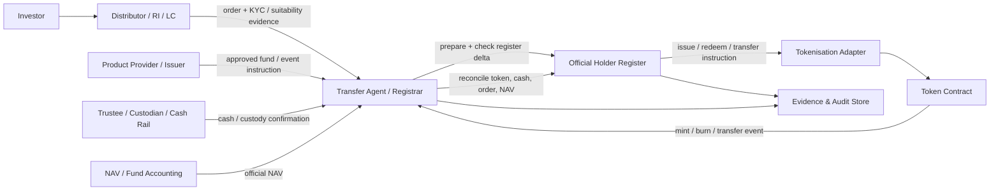
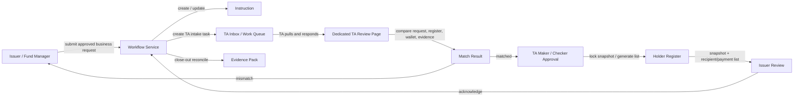
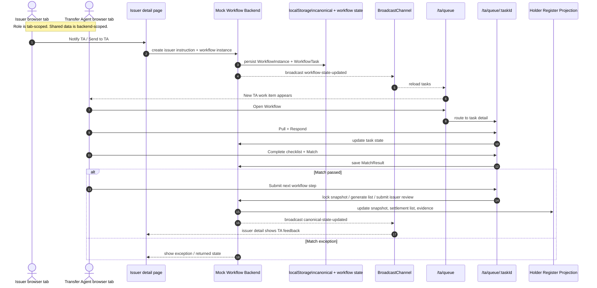
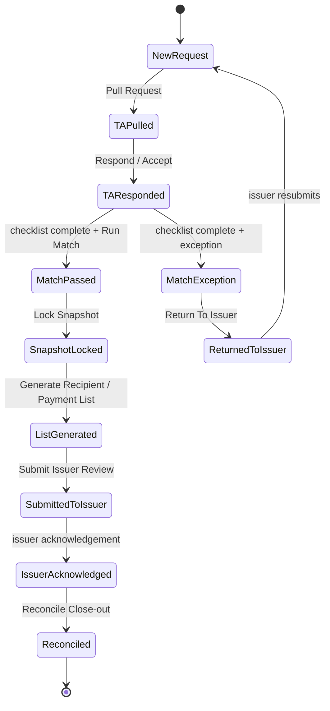
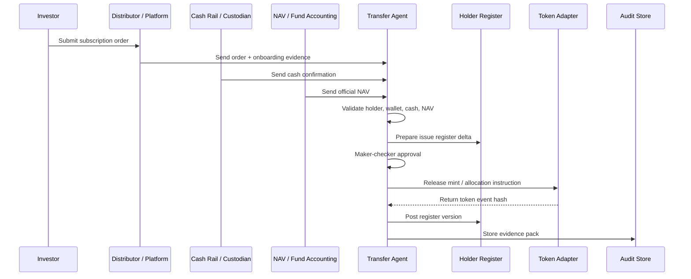
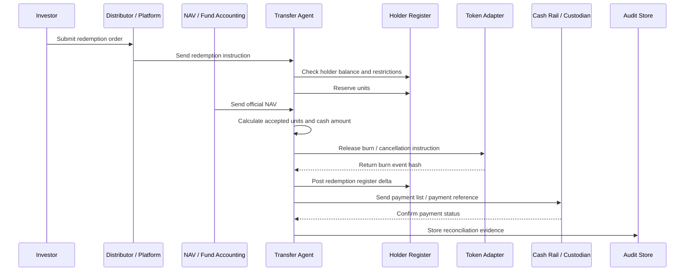
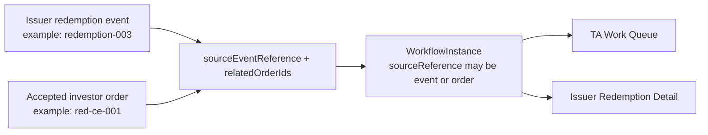
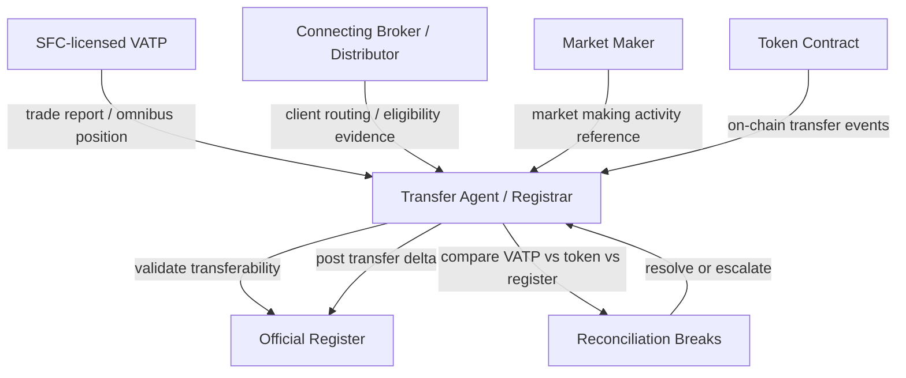
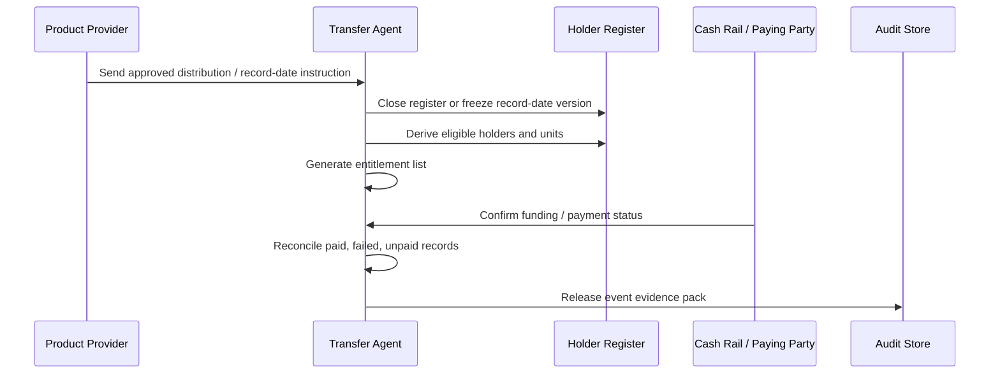

# FLOW - Hong Kong Transfer Agency Register Operations

Date: 2026-05-11
Scope: Transfer Agent / Registrar client for Hong Kong fund RWA platform
Related:

- `05_Architecture/Specs/SPEC - Hong Kong Transfer Agent Client.md`
- `03_Tickets/Active/TICKET - Hong Kong Transfer Agent Client UI.md`
- `05_Architecture/Diagrams/ARCH - Fund Lifecycle Sequence Diagrams.md`

## 1. Core Flow

The Transfer Agent client should be designed around controlled register movement.

Important update:

> TA transaction work must be modeled as an approval workflow. A TA work queue row is only an entry point into a review task. It should not directly execute `Lock Snapshot`, `Generate Recipient List`, `Generate Payment List`, or `Submit Issuer Review`.

Current implemented UI mapping:

| Operating need | Route | Notes |
| --- | --- | --- |
| TA operating console | `/ta` | Book of Record summary, workflow health, exceptions, and evidence entry points |
| TA intake and work queue | `/ta/queue` | Projects `WorkflowTask`; filters first by workflow area, then by task stage |
| Dedicated TA approval page | `/ta/queue/:taskId` | Pull, respond, match, identity-gated submit, issuer review, and reconcile actions |
| Book of Record / fund management | `/ta/register` | Fund-scoped register versions, snapshots, holder rows, evidence, and anchors |
| Book of Record / user management | `/ta/admissions` | Holder onboarding, wallet links, KYC evidence, restrictions, and admissions |
| Exceptions | `/ta/reconciliation` | Reconciliation breaks and close-out handling |
| Evidence | `/ta/register` | Evidence is reviewed through fund snapshots and audit context instead of a standalone route |

Demo implementation note:

- Role is scoped per browser tab with `sessionStorage`, so one window can be Issuer and another can be Transfer Agent.
- Workflow and canonical register data are shared through `localStorage` and `BroadcastChannel`.
- If an issuer distribution or redemption page is already waiting for TA but the workflow task is missing, the mock backend repairs the missing TA workflow so `/ta/queue` can show it.

## 1.1 TA Workflow Intake Pattern

This is the required pattern for issuer-originated distribution and redemption requests.

Current two-tab sequence:

Review gate:

## 2. Primary Subscription

Blocking conditions:

- cash not confirmed
- NAV not final
- wallet not bound or not whitelisted
- KYC / suitability evidence missing
- token mint amount differs from register delta

## 3. Primary Redemption

Redemption event/order linkage:

Rule:

> When a TA task is created at order level, the issuer event page must still surface it through `sourceEventReference` / `relatedOrderIds`, and the TA page must show both the issuer event and the related order.

Blocking conditions:

- insufficient register balance
- dealing cut-off missed
- redemption gate / suspension active
- payment owner not ready
- burn / cancellation event missing

## 4. Secondary Transfer Bridge

Only applies where secondary trading has been approved and enabled.

Common breaks:

- VATP report shows more units than the register.
- Token balance changed but no valid register instruction exists.
- Omnibus holder changed without approved transfer arrangement.
- Secondary holder requests primary redemption without a valid register mapping.
- Primary dealing is suspended but secondary trading remains open without contingency assessment.

## 5. Record Date / Distribution

Important rule:

> The entitlement list is derived from the official register and event terms. It is not a separate investor-rule filter controlled by the issuer at payment time.

## 6. Responsibility Boundary

| Step | Accountable | Operating owner | Evidence source |
| --- | --- | --- | --- |
| Product approval | Product Provider | Product Provider | product approval record |
| KYC / suitability | Distributor / regulated intermediary | Distributor | onboarding evidence |
| Cash confirmation | Custodian / cash rail / operations | cash owner | payment reference |
| NAV confirmation | Fund accounting / valuation party | NAV owner | official NAV record |
| Register posting | Product Provider ultimately responsible | Transfer Agent | register delta and checker approval |
| Token mint / burn | Product Provider ultimately responsible | Tokenisation adapter / authorised operator | chain event hash |
| Reconciliation | Product Provider ultimately responsible | Transfer Agent | break log and evidence pack |

## 7. Client Screens Implied by Flow

Minimum implementation:

- `TA Dashboard` / `/ta`
- `Work Queue` / `/ta/queue`
- `Dedicated Workflow Detail` / `/ta/queue/:taskId`
- `Book of Record / Fund Management` / `/ta/register`
- `Book of Record / User Management` / `/ta/admissions`
- `Reconciliation Breaks` / `/ta/reconciliation`
- `Evidence Pack` / fund snapshot audit inside `/ta/register`

Secondary-trading backlog, not exposed in the current MVP navigation:

- `Primary-Secondary Bridge`
- `VATP Position Reconciliation`
- `Market Maker / Trading Channel Reference`
- `Suspension and Contingency Controls`
