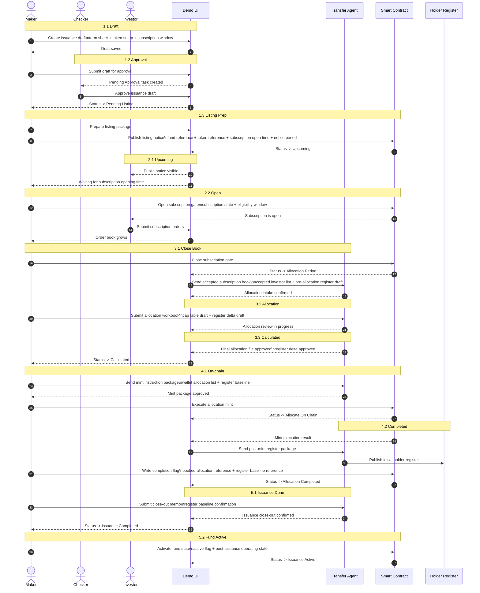
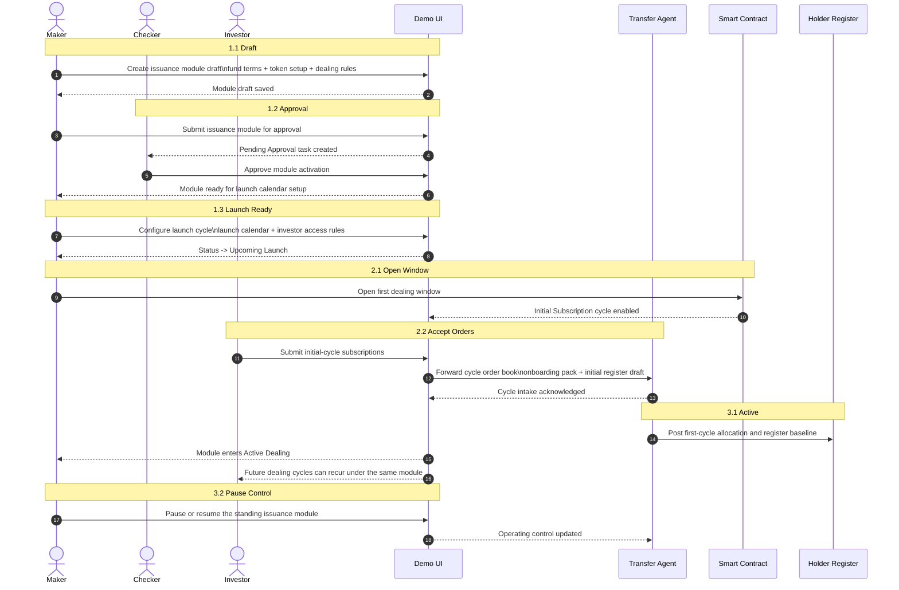
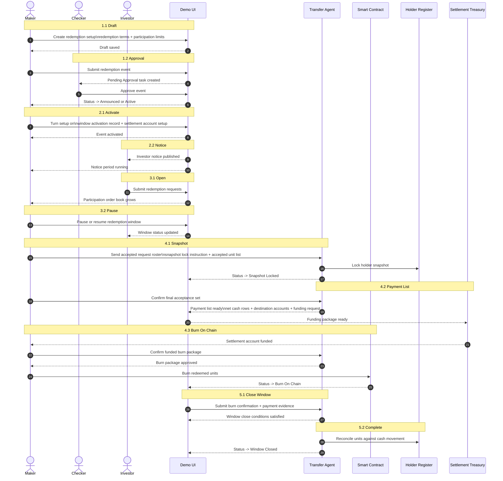
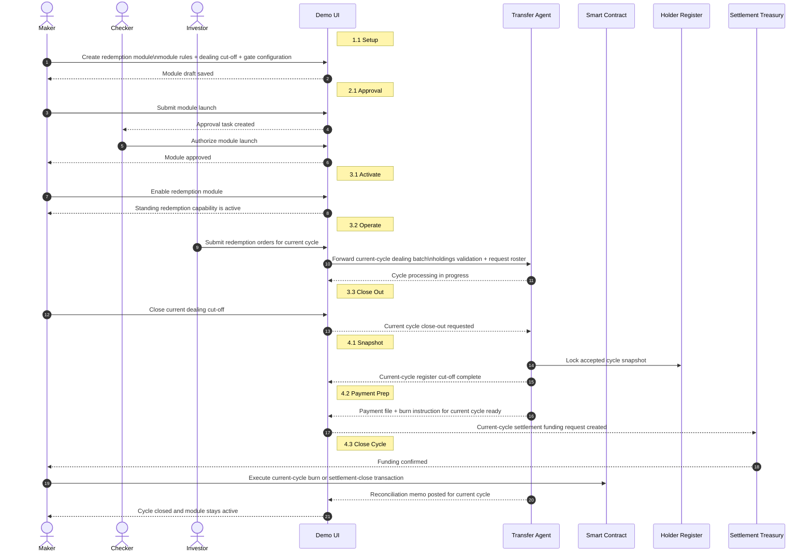
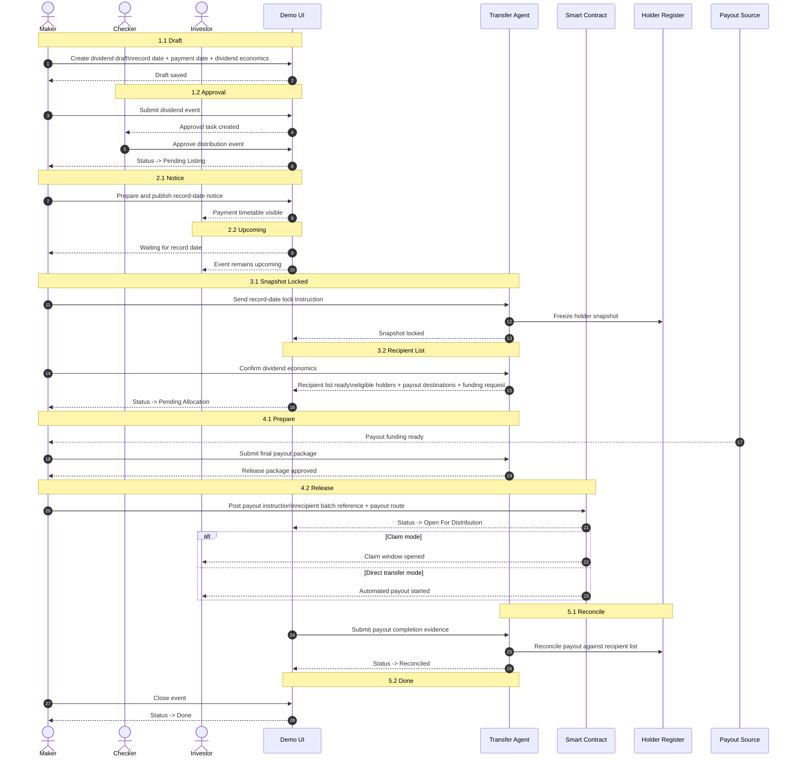
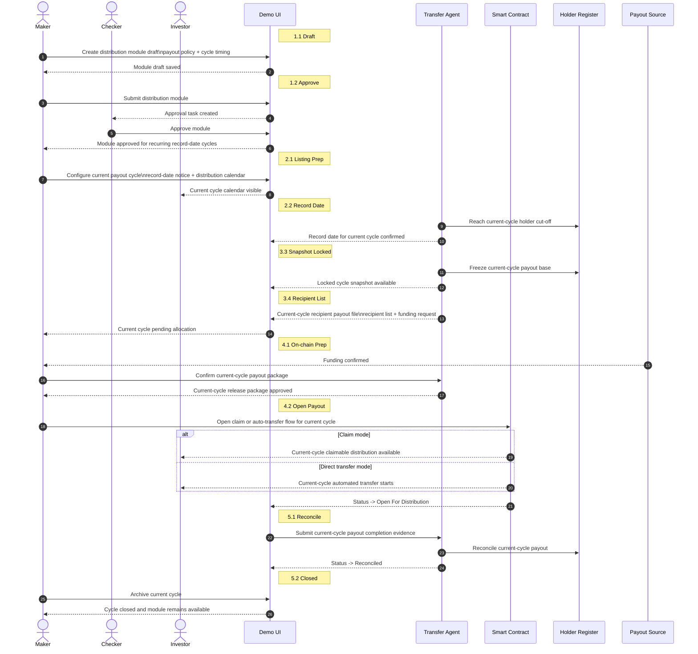

# ARCH - Fund Lifecycle Sequence Diagrams

## Purpose

This note gives developers one place to review the sequence diagrams for the three main lifecycle modules in the demo:

1. `Issuance`
2. `Redemption`
3. `Distribution / Dividend`

Each module is shown in both `Closed-end` and `Open-end` form where the product currently models both.

For `Open-end` products, the diagrams below should be read as `module + recurring cycle` flows rather than one-off event flows. The numbering still follows the current UI so developers can map the diagrams back to the product.

These diagrams follow three rules:

- actor names use `Maker` and `Checker`
- stage numbering follows the numbering already shown in the system UI
- stage annotations use Mermaid's yellow `note` banner only, not a full highlighted background block

Rendering convention:

- each numbered sub-stage should be shown as a compact top banner such as `note over Maker,UI: 4.1 Snapshot`
- do not wrap full message sections in colored `rect ... end` background blocks

## Shared Actor Model

- `Maker`: the operator who prepares, submits, and executes maker-side workflow actions
- `Checker`: the operator who reviews and approves gated actions
- `UI`: the workflow UI plus app-side orchestration layer
- `TA`: transfer agent operating role
- `Chain`: smart contract / on-chain state layer
- `Register`: holder register / TA posting layer
- `Treasury`: funding or payout source when cash movement matters
- `Investor`: external holder or subscriber

## 1. Issuance

### 1.1 Closed-end Issuance

### 1.2 Open-end Issuance

## 2. Redemption

### 2.1 Closed-end Redemption

### 2.2 Open-end Redemption

## 3. Distribution / Dividend

### 3.1 Closed-end Distribution / Dividend

### 3.2 Open-end Distribution

## Developer Notes

- These diagrams are intended as developer-facing target semantics, not as exact backend implementation traces
- the stage numbering is intentionally aligned with the numbered sub-stages already shown in the product UI
- stage annotations use Mermaid note banners only; do not convert them into full-width colored background blocks
- open-end diagrams should be read as `module + cycle` flows, even when the current UI still uses event-like labels
- where the current UI and the target semantics still diverge, this file should be treated as the intended workflow reference
