# ARCH - Fund Lifecycle Sequence Diagrams

## Purpose

This note gives developers one place to review the sequence diagrams for the three main lifecycle modules in the demo:

1. `Issuance`
2. `Redemption`
3. `Distribution / Dividend`

Each module is shown in both `Closed-end` and `Open-end` form where the product currently models both.

For `Open-end` products, the diagrams below should be read as `module + recurring cycle` flows rather than one-off event flows. The numbering still follows the current UI so developers can map the diagrams back to the product.

These diagrams follow three rules:

- actor names use `Maker` and `Checker`
- stage numbering follows the numbering already shown in the system UI
- stage annotations use Mermaid's yellow `note` banner only, not a full highlighted background block

Rendering convention:

- each numbered sub-stage should be shown as a compact top banner such as `note over Maker,UI: 4.1 Snapshot`
- do not wrap full message sections in colored `rect ... end` background blocks

## Shared Actor Model

- `Maker`: the operator who prepares, submits, and executes maker-side workflow actions
- `Checker`: the operator who reviews and approves gated actions
- `UI`: the workflow UI plus app-side orchestration layer
- `TA`: transfer agent operating role
- `Chain`: smart contract / on-chain state layer
- `Register`: holder register / TA posting layer
- `Treasury`: funding or payout source when cash movement matters
- `Investor`: external holder or subscriber

## 1. Issuance

### 1.1 Closed-end Issuance

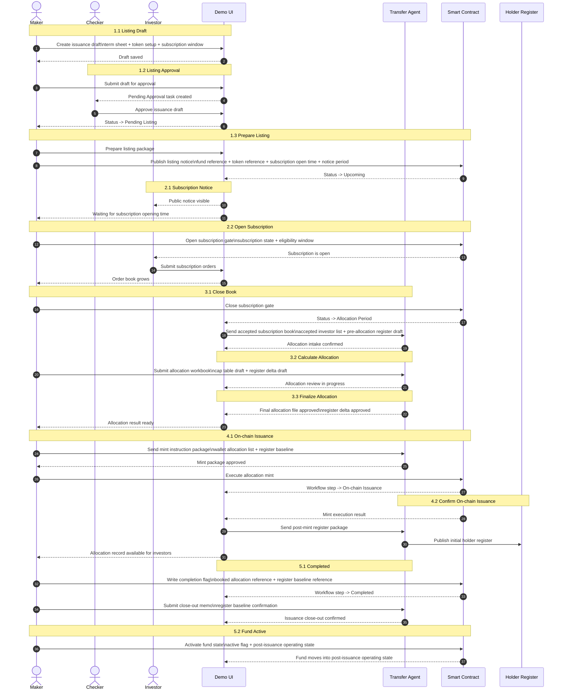
```mermaid
sequenceDiagram
    autonumber
    actor Maker as Maker
    actor Checker as Checker
    actor Investor as Investor
    participant UI as Demo UI
    participant TA as Transfer Agent
    participant Chain as Smart Contract
    participant Register as Holder Register

    note over Maker,UI: 1.1 Listing Draft
    Maker->>UI: Create issuance draft\nterm sheet + token setup + subscription window
    UI-->>Maker: Draft saved

    note over Checker,UI: 1.2 Listing Approval
    Maker->>UI: Submit draft for approval
    UI-->>Checker: Pending Approval task created
    Checker->>UI: Approve issuance draft
    UI-->>Maker: Status -> Pending Listing

    note over Maker,Chain: 1.3 Prepare Listing
    Maker->>UI: Prepare listing package
    Maker->>Chain: Publish listing notice\nfund reference + token reference + subscription open time + notice period
    Chain-->>UI: Status -> Upcoming

    note over UI,Investor: 2.1 Subscription Notice
    UI-->>Investor: Public notice visible
    UI-->>Maker: Waiting for subscription opening time

    note over Maker,Chain: 2.2 Open Subscription
    Maker->>Chain: Open subscription gate\nsubscription state + eligibility window
    Chain-->>Investor: Subscription is open
    Investor->>UI: Submit subscription orders
    UI-->>Maker: Order book grows

    note over Maker,TA: 3.1 Close Book
    Maker->>Chain: Close subscription gate
    Chain-->>UI: Status -> Allocation Period
    UI->>TA: Send accepted subscription book\naccepted investor list + pre-allocation register draft
    TA-->>UI: Allocation intake confirmed

    note over TA,UI: 3.2 Calculate Allocation
    Maker->>TA: Submit allocation workbook\ncap table draft + register delta draft
    TA-->>UI: Allocation review in progress

    note over TA,UI: 3.3 Finalize Allocation
    TA-->>UI: Final allocation file approved\nregister delta approved
    UI-->>Maker: Allocation result ready

    note over Maker,Chain: 4.1 On-chain Issuance
    Maker->>TA: Send mint instruction package\nwallet allocation list + register baseline
    TA-->>Maker: Mint package approved
    Maker->>Chain: Execute allocation mint
    Chain-->>UI: Workflow step -> On-chain Issuance

    note over TA,Register: 4.2 Confirm On-chain Issuance
    Chain-->>UI: Mint execution result
    UI->>TA: Send post-mint register package
    TA->>Register: Publish initial holder register
    UI-->>Maker: Allocation record available for investors

    note over TA,UI: 5.1 Completed
    Maker->>Chain: Write completion flag\nbooked allocation reference + register baseline reference
    Chain-->>UI: Workflow step -> Completed
    Maker->>TA: Submit close-out memo\nregister baseline confirmation
    TA-->>UI: Issuance close-out confirmed

    note over Maker,Chain: 5.2 Fund Active
    Maker->>Chain: Activate fund state\nactive flag + post-issuance operating state
    Chain-->>UI: Fund moves into post-issuance operating state
```

### 1.2 Open-end Issuance

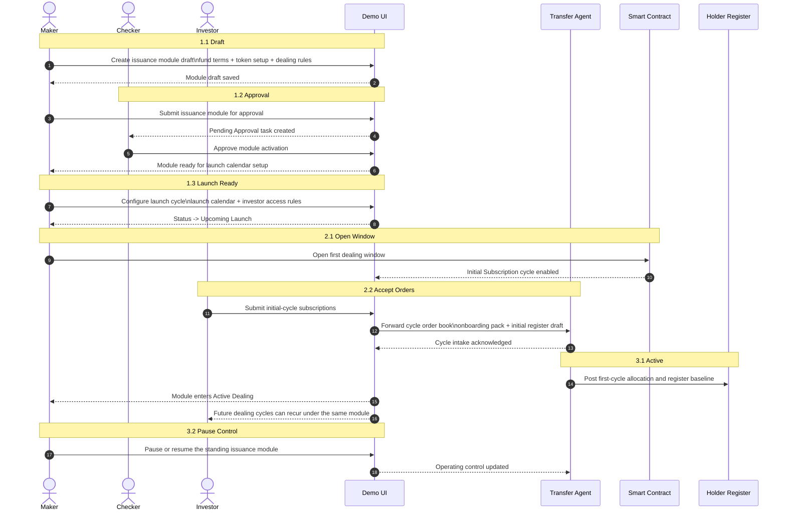
```mermaid
sequenceDiagram
    autonumber
    actor Maker as Maker
    actor Checker as Checker
    actor Investor as Investor
    participant UI as Demo UI
    participant TA as Transfer Agent
    participant Chain as Smart Contract
    participant Register as Holder Register

    note over Maker,UI: 1.1 Draft
    Maker->>UI: Create issuance module draft\nfund terms + token setup + dealing rules
    UI-->>Maker: Module draft saved

    note over Checker,UI: 1.2 Approval
    Maker->>UI: Submit issuance module for approval
    UI-->>Checker: Pending Approval task created
    Checker->>UI: Approve module activation
    UI-->>Maker: Module ready for launch calendar setup

    note over Maker,UI: 1.3 Launch Ready
    Maker->>UI: Configure launch cycle\nlaunch calendar + investor access rules
    UI-->>Maker: Status -> Upcoming Launch

    note over Maker,Chain: 2.1 Open Window
    Maker->>Chain: Open first dealing window
    Chain-->>UI: Initial Subscription cycle enabled

    note over Investor,TA: 2.2 Accept Orders
    Investor->>UI: Submit initial-cycle subscriptions
    UI->>TA: Forward cycle order book\nonboarding pack + initial register draft
    TA-->>UI: Cycle intake acknowledged

    note over TA,Register: 3.1 Active
    TA->>Register: Post first-cycle allocation and register baseline
    UI-->>Maker: Module enters Active Dealing
    UI-->>Investor: Future dealing cycles can recur under the same module

    note over Maker,UI: 3.2 Pause Control
    Maker->>UI: Pause or resume the standing issuance module
    UI-->>TA: Operating control updated
```

## 2. Redemption

### 2.1 Closed-end Redemption

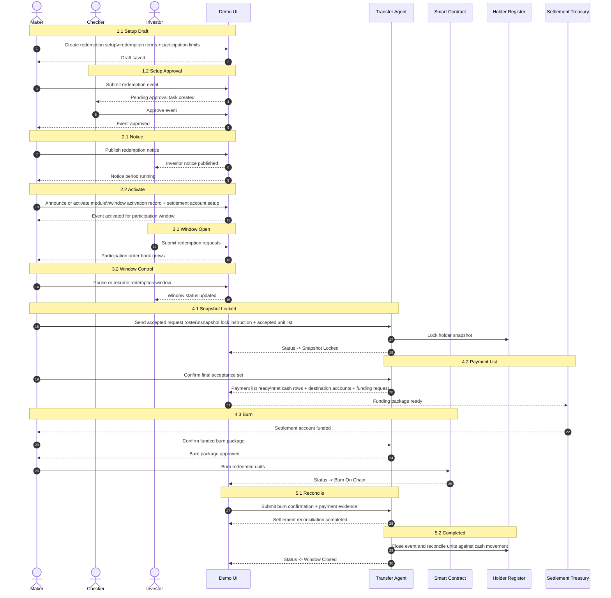
```mermaid
sequenceDiagram
    autonumber
    actor Maker as Maker
    actor Checker as Checker
    actor Investor as Investor
    participant UI as Demo UI
    participant TA as Transfer Agent
    participant Chain as Smart Contract
    participant Register as Holder Register
    participant Treasury as Settlement Treasury

    note over Maker,UI: 1.1 Setup Draft
    Maker->>UI: Create redemption setup\nredemption terms + participation limits
    UI-->>Maker: Draft saved

    note over Checker,UI: 1.2 Setup Approval
    Maker->>UI: Submit redemption event
    UI-->>Checker: Pending Approval task created
    Checker->>UI: Approve event
    UI-->>Maker: Event approved

    note over Maker,UI: 2.1 Notice
    Maker->>UI: Publish redemption notice
    UI-->>Investor: Investor notice published
    UI-->>Maker: Notice period running

    note over Maker,UI: 2.2 Activate
    Maker->>UI: Announce or activate module\nwindow activation record + settlement account setup
    UI-->>Maker: Event activated for participation window

    note over Investor,UI: 3.1 Window Open
    Investor->>UI: Submit redemption requests
    UI-->>Maker: Participation order book grows

    note over Maker,UI: 3.2 Window Control
    Maker->>UI: Pause or resume redemption window
    UI-->>Investor: Window status updated

    note over Maker,TA: 4.1 Snapshot Locked
    Maker->>TA: Send accepted request roster\nsnapshot lock instruction + accepted unit list
    TA->>Register: Lock holder snapshot
    TA-->>UI: Status -> Snapshot Locked

    note over TA,Treasury: 4.2 Payment List
    Maker->>TA: Confirm final acceptance set
    TA-->>UI: Payment list ready\nnet cash rows + destination accounts + funding request
    UI-->>Treasury: Funding package ready

    note over Maker,Chain: 4.3 Burn
    Treasury-->>Maker: Settlement account funded
    Maker->>TA: Confirm funded burn package
    TA-->>Maker: Burn package approved
    Maker->>Chain: Burn redeemed units
    Chain-->>UI: Status -> Burn On Chain

    note over TA,UI: 5.1 Reconcile
    UI->>TA: Submit burn confirmation + payment evidence
    TA-->>UI: Settlement reconciliation completed

    note over TA,Register: 5.2 Completed
    TA->>Register: Close event and reconcile units against cash movement
    TA-->>UI: Status -> Window Closed
```

### 2.2 Open-end Redemption Module

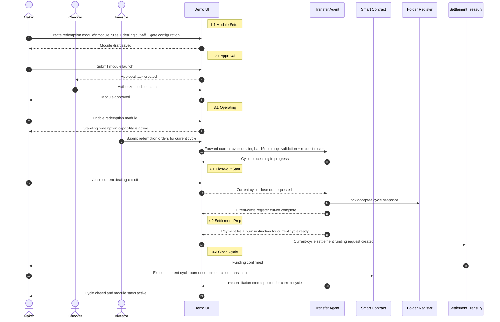
```mermaid
sequenceDiagram
    autonumber
    actor Maker as Maker
    actor Checker as Checker
    actor Investor as Investor
    participant UI as Demo UI
    participant TA as Transfer Agent
    participant Chain as Smart Contract
    participant Register as Holder Register
    participant Treasury as Settlement Treasury

    note right of UI: 1.1 Module Setup
    Maker->>UI: Create redemption module\nmodule rules + dealing cut-off + gate configuration
    UI-->>Maker: Module draft saved

    note right of UI: 2.1 Approval
    Maker->>UI: Submit module launch
    UI-->>Checker: Approval task created
    Checker->>UI: Authorize module launch
    UI-->>Maker: Module approved

    note right of UI: 3.1 Operating
    Maker->>UI: Enable redemption module
    UI-->>Maker: Standing redemption capability is active

    Investor->>UI: Submit redemption orders for current cycle
    UI->>TA: Forward current-cycle dealing batch\nholdings validation + request roster
    TA-->>UI: Cycle processing in progress

    note right of UI: 4.1 Close-out Start
    Maker->>UI: Close current dealing cut-off
    UI-->>TA: Current cycle close-out requested

    TA->>Register: Lock accepted cycle snapshot
    TA-->>UI: Current-cycle register cut-off complete

    note right of UI: 4.2 Settlement Prep
    TA-->>UI: Payment file + burn instruction for current cycle ready
    UI-->>Treasury: Current-cycle settlement funding request created

    note right of UI: 4.3 Close Cycle
    Treasury-->>Maker: Funding confirmed
    Maker->>Chain: Execute current-cycle burn or settlement-close transaction
    TA-->>UI: Reconciliation memo posted for current cycle
    UI-->>Maker: Cycle closed and module stays active
```

## 3. Distribution / Dividend

### 3.1 Closed-end Distribution / Dividend

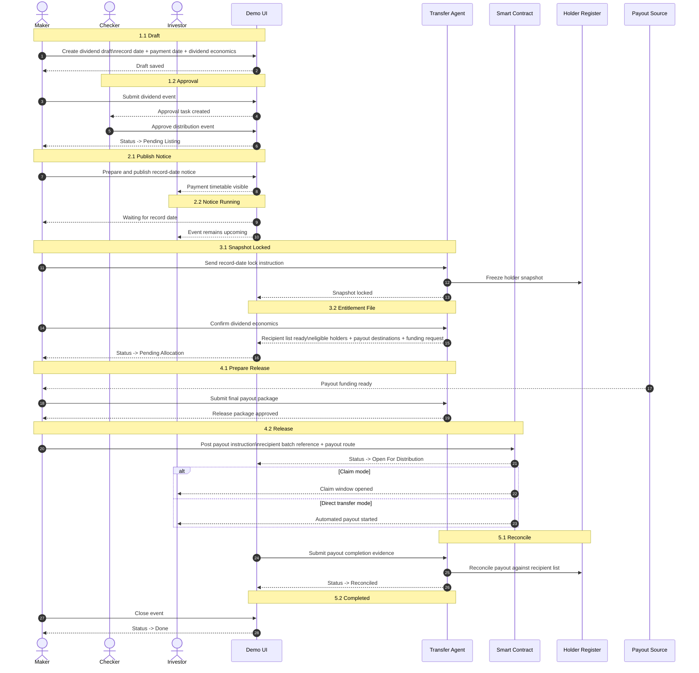
```mermaid
sequenceDiagram
    autonumber
    actor Maker as Maker
    actor Checker as Checker
    actor Investor as Investor
    participant UI as Demo UI
    participant TA as Transfer Agent
    participant Chain as Smart Contract
    participant Register as Holder Register
    participant Treasury as Payout Source

    note over Maker,UI: 1.1 Draft
    Maker->>UI: Create dividend draft\nrecord date + payment date + dividend economics
    UI-->>Maker: Draft saved

    note over Checker,UI: 1.2 Approval
    Maker->>UI: Submit dividend event
    UI-->>Checker: Approval task created
    Checker->>UI: Approve distribution event
    UI-->>Maker: Status -> Pending Listing

    note over Maker,UI: 2.1 Publish Notice
    Maker->>UI: Prepare and publish record-date notice
    UI-->>Investor: Payment timetable visible

    note over UI,Investor: 2.2 Notice Running
    UI-->>Maker: Waiting for record date
    UI-->>Investor: Event remains upcoming

    note over Maker,TA: 3.1 Snapshot Locked
    Maker->>TA: Send record-date lock instruction
    TA->>Register: Freeze holder snapshot
    TA-->>UI: Snapshot locked

    note over TA,UI: 3.2 Entitlement File
    Maker->>TA: Confirm dividend economics
    TA-->>UI: Recipient list ready\neligible holders + payout destinations + funding request
    UI-->>Maker: Status -> Pending Allocation

    note over Maker,TA: 4.1 Prepare Release
    Treasury-->>Maker: Payout funding ready
    Maker->>TA: Submit final payout package
    TA-->>Maker: Release package approved

    note over Maker,Chain: 4.2 Release
    Maker->>Chain: Post payout instruction\nrecipient batch reference + payout route
    Chain-->>UI: Status -> Open For Distribution
    alt Claim mode
        Chain-->>Investor: Claim window opened
    else Direct transfer mode
        Chain-->>Investor: Automated payout started
    end

    note over TA,Register: 5.1 Reconcile
    UI->>TA: Submit payout completion evidence
    TA->>Register: Reconcile payout against recipient list
    TA-->>UI: Status -> Reconciled

    note over TA,UI: 5.2 Completed
    Maker->>UI: Close event
    UI-->>Maker: Status -> Done
```

### 3.2 Open-end Distribution Module

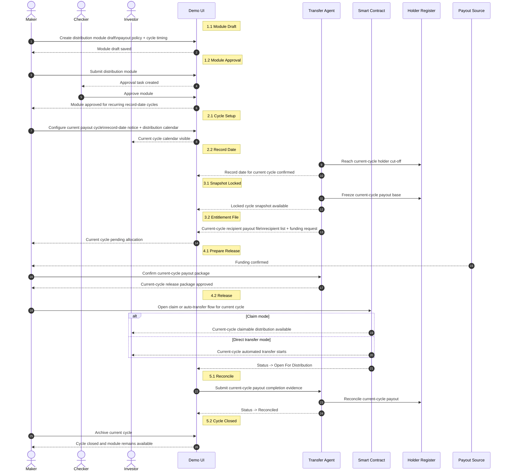
```mermaid
sequenceDiagram
    autonumber
    actor Maker as Maker
    actor Checker as Checker
    actor Investor as Investor
    participant UI as Demo UI
    participant TA as Transfer Agent
    participant Chain as Smart Contract
    participant Register as Holder Register
    participant Treasury as Payout Source

    note right of UI: 1.1 Module Draft
    Maker->>UI: Create distribution module draft\npayout policy + cycle timing
    UI-->>Maker: Module draft saved

    note right of UI: 1.2 Module Approval
    Maker->>UI: Submit distribution module
    UI-->>Checker: Approval task created
    Checker->>UI: Approve module
    UI-->>Maker: Module approved for recurring record-date cycles

    note right of UI: 2.1 Cycle Setup
    Maker->>UI: Configure current payout cycle\nrecord-date notice + distribution calendar
    UI-->>Investor: Current cycle calendar visible

    note right of UI: 2.2 Record Date
    TA->>Register: Reach current-cycle holder cut-off
    TA-->>UI: Record date for current cycle confirmed

    note right of UI: 3.1 Snapshot Locked
    TA->>Register: Freeze current-cycle payout base
    TA-->>UI: Locked cycle snapshot available

    note right of UI: 3.2 Entitlement File
    TA-->>UI: Current-cycle recipient payout file\nrecipient list + funding request
    UI-->>Maker: Current cycle pending allocation

    note right of UI: 4.1 Prepare Release
    Treasury-->>Maker: Funding confirmed
    Maker->>TA: Confirm current-cycle payout package
    TA-->>Maker: Current-cycle release package approved

    note right of UI: 4.2 Release
    Maker->>Chain: Open claim or auto-transfer flow for current cycle
    alt Claim mode
        Chain-->>Investor: Current-cycle claimable distribution available
    else Direct transfer mode
        Chain-->>Investor: Current-cycle automated transfer starts
    end
    Chain-->>UI: Status -> Open For Distribution

    note right of UI: 5.1 Reconcile
    UI->>TA: Submit current-cycle payout completion evidence
    TA->>Register: Reconcile current-cycle payout
    TA-->>UI: Status -> Reconciled

    note right of UI: 5.2 Cycle Closed
    Maker->>UI: Archive current cycle
    UI-->>Maker: Cycle closed and module remains available
```

## Developer Notes

- These diagrams are intended as developer-facing target semantics, not as exact backend implementation traces
- the stage numbering is intentionally aligned with the numbered sub-stages already shown in the product UI
- stage annotations use Mermaid note banners only; do not convert them into full-width colored background blocks
- open-end diagrams should be read as `module + cycle` flows, even when the current UI still uses event-like labels
- where the current UI and the target semantics still diverge, this file should be treated as the intended workflow reference

## 4. Transfer Agent Workflow Handoff

This section supersedes the earlier simplified `UI -> TA -> Register` traces for transaction work.
Transfer Agent is a separate workflow party, not a hidden service call inside the Issuer page.

Target design:

- Issuer creates or approves business intent.
- Backend creates a workflow instance and a TA intake task.
- TA pulls the request, responds, matches canonical data, and only then advances the workflow.
- Snapshot locking, recipient/payment-list generation, issuer review, and reconciliation are workflow steps with ownership, audit, and review gates.
- Direct `Lock Snapshot` or `Generate List` buttons in a table are insufficient unless they open a dedicated task review page first.
- Current demo implementation uses a separate TA interface:
  - `/ta` for the console
  - `/ta/queue` for workflow intake
  - `/ta/queue/:taskId` for the review-gated approval page
  - `/ta/register` for Book of Record / fund management, snapshots, holder register lookup, and evidence audit
  - `/ta/reconciliation` for exceptions and reconciliation breaks
- Demo role is tab-scoped with `sessionStorage`; canonical workflow data is shared through `localStorage` and `BroadcastChannel`.
- Redemption workflows may be event-level or order-level. Use `sourceEventReference` and `relatedOrderIds` to map an order task such as `red-ce-001` back to the issuer event such as `redemption-003`.

### 4.0 Current Mock UI / Backend Sequence

This is the implementation trace for the current React mock backend. It is the canonical diagram for the demo now that TA has a dedicated UI.

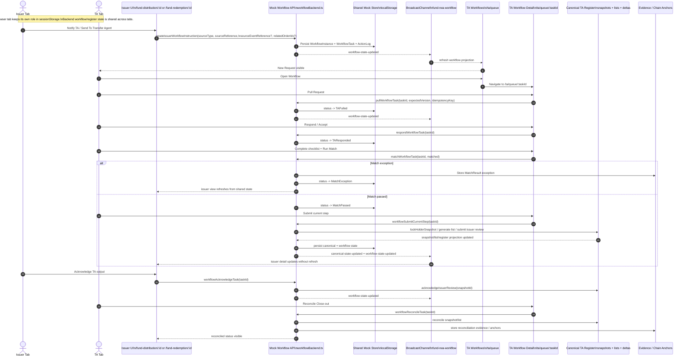
```mermaid
sequenceDiagram
    autonumber
    actor Issuer as Issuer Tab
    actor TAUser as TA Tab
    participant IssuerUI as Issuer UI\n/fund-distribution/:id or /fund-redemption/:id
    participant MockAPI as Mock Workflow API\nworkflowBackend.ts
    participant Store as Shared Mock Store\nlocalStorage
    participant Bus as BroadcastChannel\nfund-rwa-workflow
    participant TAQueue as TA Workflows\n/ta/queue
    participant TADetail as TA Workflow Detail\n/ta/queue/:taskId
    participant Register as Canonical TA Register\nsnapshots + lists + deltas
    participant Evidence as Evidence / Chain Anchors

    note over Issuer,TAUser: Each browser tab keeps its own role in sessionStorage.\nBackend workflow/register state is shared across tabs.

    Issuer->>IssuerUI: Notify TA / Send To Transfer Agent
    IssuerUI->>MockAPI: createIssuerWorkflowInstruction(sourceType, sourceReference,\nsourceEventReference?, relatedOrderIds?)
    MockAPI->>Store: Persist WorkflowInstance + WorkflowTask + ActionLog
    MockAPI-->>Bus: workflow-state-updated
    Bus-->>TAQueue: refresh workflow projection
    TAQueue-->>TAUser: New Request visible

    TAUser->>TAQueue: Open Workflow
    TAQueue->>TADetail: Navigate to /ta/queue/:taskId
    TAUser->>TADetail: Pull Request
    TADetail->>MockAPI: pullWorkflowTask(taskId, expectedVersion, idempotencyKey)
    MockAPI->>Store: status -> TAPulled
    MockAPI-->>Bus: workflow-state-updated

    TAUser->>TADetail: Respond / Accept
    TADetail->>MockAPI: respondWorkflowTask(taskId)
    MockAPI->>Store: status -> TAResponded
    TAUser->>TADetail: Complete checklist + Run Match
    TADetail->>MockAPI: matchWorkflowTask(taskId, matched)
    alt Match exception
        MockAPI->>Evidence: Store MatchResult exception
        MockAPI->>Store: status -> MatchException
        MockAPI-->>IssuerUI: issuer view refreshes from shared state
    else Match passed
        MockAPI->>Store: status -> MatchPassed
        TAUser->>TADetail: Submit current step
        TADetail->>MockAPI: workflowSubmitCurrentStep(taskId)
        MockAPI->>Register: lockHolderSnapshot / generate list / submit issuer review
        Register-->>MockAPI: snapshot/list/register projection updated
        MockAPI->>Store: persist canonical + workflow state
        MockAPI-->>Bus: canonical-state-updated + workflow-state-updated
        Bus-->>IssuerUI: issuer detail updates without refresh
    end

    Issuer->>IssuerUI: Acknowledge TA output
    IssuerUI->>MockAPI: workflowAcknowledgeTask(taskId)
    MockAPI->>Register: acknowledgeIssuerReview(snapshotId)
    MockAPI-->>Bus: workflow-state-updated
    TAUser->>TADetail: Reconcile Close-out
    TADetail->>MockAPI: workflowReconcileTask(taskId)
    MockAPI->>Register: reconcile snapshot/list
    MockAPI->>Evidence: store reconciliation evidence / anchors
    MockAPI-->>IssuerUI: reconciled status visible
```

### 4.1 Distribution / Record-date Handoff

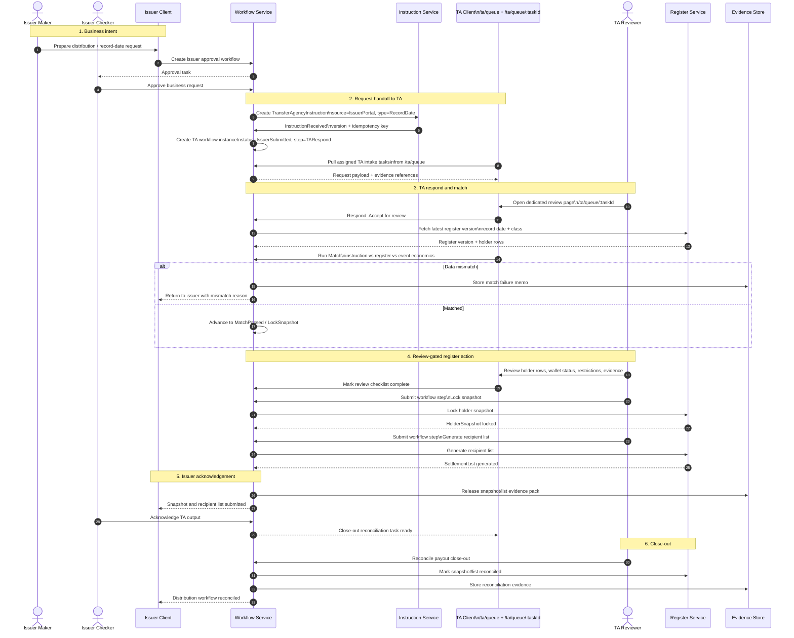
```mermaid
sequenceDiagram
    autonumber
    actor IssuerMaker as Issuer Maker
    actor IssuerChecker as Issuer Checker
    participant IssuerUI as Issuer Client
    participant Workflow as Workflow Service
    participant Instruction as Instruction Service
    participant TAUI as TA Client\n/ta/queue + /ta/queue/:taskId
    actor TAReviewer as TA Reviewer
    participant Register as Register Service
    participant Evidence as Evidence Store

    note over IssuerMaker,IssuerUI: 1. Business intent
    IssuerMaker->>IssuerUI: Prepare distribution / record-date request
    IssuerUI->>Workflow: Create issuer approval workflow
    Workflow-->>IssuerChecker: Approval task
    IssuerChecker->>Workflow: Approve business request

    note over Workflow,TAUI: 2. Request handoff to TA
    Workflow->>Instruction: Create TransferAgencyInstruction\nsource=IssuerPortal, type=RecordDate
    Instruction->>Workflow: InstructionReceived\nversion + idempotency key
    Workflow->>Workflow: Create TA workflow instance\nstatus=IssuerSubmitted, step=TARespond
    TAUI->>Workflow: Pull assigned TA intake tasks\nfrom /ta/queue
    Workflow-->>TAUI: Request payload + evidence references

    note over TAReviewer,Workflow: 3. TA respond and match
    TAReviewer->>TAUI: Open dedicated review page\n/ta/queue/:taskId
    TAUI->>Workflow: Respond: Accept for review
    Workflow->>Register: Fetch latest register version\nrecord date + class
    Register-->>Workflow: Register version + holder rows
    TAUI->>Workflow: Run Match\ninstruction vs register vs event economics
    alt Data mismatch
        Workflow->>Evidence: Store match failure memo
        Workflow-->>IssuerUI: Return to issuer with mismatch reason
    else Matched
        Workflow->>Workflow: Advance to MatchPassed / LockSnapshot
    end

    note over TAReviewer,Workflow: 4. Review-gated register action
    TAReviewer->>TAUI: Review holder rows, wallet status, restrictions, evidence
    TAUI->>Workflow: Mark review checklist complete
    TAReviewer->>Workflow: Submit workflow step\nLock snapshot
    Workflow->>Register: Lock holder snapshot
    Register-->>Workflow: HolderSnapshot locked
    TAReviewer->>Workflow: Submit workflow step\nGenerate recipient list
    Workflow->>Register: Generate recipient list
    Register-->>Workflow: SettlementList generated

    note over Workflow,IssuerUI: 5. Issuer acknowledgement
    Workflow->>Evidence: Release snapshot/list evidence pack
    Workflow-->>IssuerUI: Snapshot and recipient list submitted
    IssuerChecker->>Workflow: Acknowledge TA output
    Workflow-->>TAUI: Close-out reconciliation task ready

    note over TAReviewer,Register: 6. Close-out
    TAReviewer->>Workflow: Reconcile payout close-out
    Workflow->>Register: Mark snapshot/list reconciled
    Workflow->>Evidence: Store reconciliation evidence
    Workflow-->>IssuerUI: Distribution workflow reconciled
```

### 4.2 Redemption / Payment-list Handoff

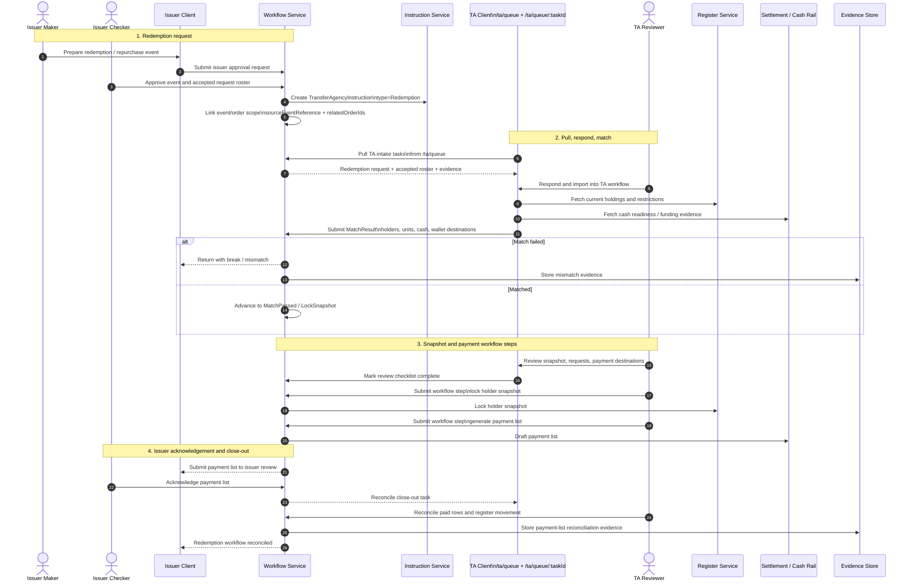
```mermaid
sequenceDiagram
    autonumber
    actor IssuerMaker as Issuer Maker
    actor IssuerChecker as Issuer Checker
    participant IssuerUI as Issuer Client
    participant Workflow as Workflow Service
    participant Instruction as Instruction Service
    participant TAUI as TA Client\n/ta/queue + /ta/queue/:taskId
    actor TAReviewer as TA Reviewer
    participant Register as Register Service
    participant Settlement as Settlement / Cash Rail
    participant Evidence as Evidence Store

    note over IssuerMaker,Workflow: 1. Redemption request
    IssuerMaker->>IssuerUI: Prepare redemption / repurchase event
    IssuerUI->>Workflow: Submit issuer approval request
    IssuerChecker->>Workflow: Approve event and accepted request roster
    Workflow->>Instruction: Create TransferAgencyInstruction\ntype=Redemption
    Workflow->>Workflow: Link event/order scope\nsourceEventReference + relatedOrderIds

    note over TAUI,TAReviewer: 2. Pull, respond, match
    TAUI->>Workflow: Pull TA intake tasks\nfrom /ta/queue
    Workflow-->>TAUI: Redemption request + accepted roster + evidence
    TAReviewer->>TAUI: Respond and import into TA workflow
    TAUI->>Register: Fetch current holdings and restrictions
    TAUI->>Settlement: Fetch cash readiness / funding evidence
    TAUI->>Workflow: Submit MatchResult\nholders, units, cash, wallet destinations

    alt Match failed
        Workflow-->>IssuerUI: Return with break / mismatch
        Workflow->>Evidence: Store mismatch evidence
    else Matched
        Workflow->>Workflow: Advance to MatchPassed / LockSnapshot
    end

    note over TAReviewer,Workflow: 3. Snapshot and payment workflow steps
    TAReviewer->>TAUI: Review snapshot, requests, payment destinations
    TAUI->>Workflow: Mark review checklist complete
    TAReviewer->>Workflow: Submit workflow step\nlock holder snapshot
    Workflow->>Register: Lock holder snapshot
    TAReviewer->>Workflow: Submit workflow step\ngenerate payment list
    Workflow->>Settlement: Draft payment list

    note over IssuerChecker,Workflow: 4. Issuer acknowledgement and close-out
    Workflow-->>IssuerUI: Submit payment list to issuer review
    IssuerChecker->>Workflow: Acknowledge payment list
    Workflow-->>TAUI: Reconcile close-out task
    TAReviewer->>Workflow: Reconcile paid rows and register movement
    Workflow->>Evidence: Store payment-list reconciliation evidence
    Workflow-->>IssuerUI: Redemption workflow reconciled
```

### 4.3 TA Workflow Instance State Machine

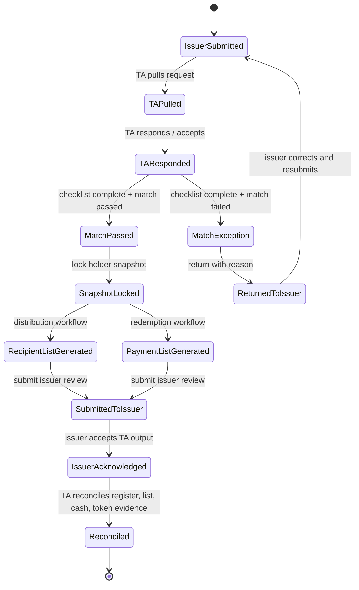
```mermaid
stateDiagram-v2
    [*] --> IssuerSubmitted
    IssuerSubmitted --> TAPulled: TA pulls request
    TAPulled --> TAResponded: TA responds / accepts
    TAResponded --> MatchPassed: checklist complete + match passed
    TAResponded --> MatchException: checklist complete + match failed
    MatchException --> ReturnedToIssuer: return with reason
    ReturnedToIssuer --> IssuerSubmitted: issuer corrects and resubmits
    MatchPassed --> SnapshotLocked: lock holder snapshot
    SnapshotLocked --> RecipientListGenerated: distribution workflow
    SnapshotLocked --> PaymentListGenerated: redemption workflow
    RecipientListGenerated --> SubmittedToIssuer: submit issuer review
    PaymentListGenerated --> SubmittedToIssuer: submit issuer review
    SubmittedToIssuer --> IssuerAcknowledged: issuer accepts TA output
    IssuerAcknowledged --> Reconciled: TA reconciles register, list, cash, token evidence
    Reconciled --> [*]
```

### 4.4 TA Task Review Gate State Machine

Every row in TA Work Queue should open a dedicated approval page.
The primary action is disabled until the task has passed evidence and match review.

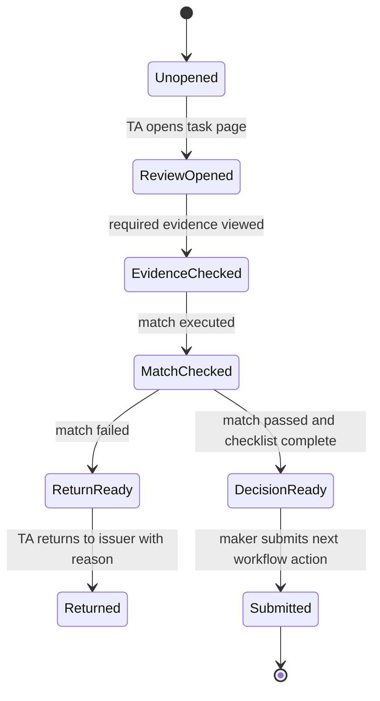
```mermaid
stateDiagram-v2
    [*] --> Unopened
    Unopened --> ReviewOpened: TA opens task page
    ReviewOpened --> EvidenceChecked: required evidence viewed
    EvidenceChecked --> MatchChecked: match executed
    MatchChecked --> DecisionReady: match passed and checklist complete
    MatchChecked --> ReturnReady: match failed
    ReturnReady --> Returned: TA returns to issuer with reason
    DecisionReady --> Submitted: maker submits next workflow action
    Submitted --> [*]
```

Current implementation audit:

| Capability | Current implementation | Target |
| --- | --- | --- |
| Shared issuer / TA data | Implemented with mock backend state, localStorage, BroadcastChannel, and projections | Replace mock backend with real service |
| TA intake request | Implemented as issuer-created `WorkflowInstance` + `WorkflowTask` | Add production API auth and server-side assignment |
| Match | Implemented as `MatchResult` with pass/fail and exception path | Add richer field-level diffs |
| Dedicated approval page | Implemented at `/ta/queue/:taskId` | Add maker/checker sub-role separation |
| Review gate | Implemented: checklist + match required before workflow submit | Add policy-driven checklist definitions |
| Workflow state machine | Implemented for distribution/redemption MVP | Extend to subscription and secondary transfers |
