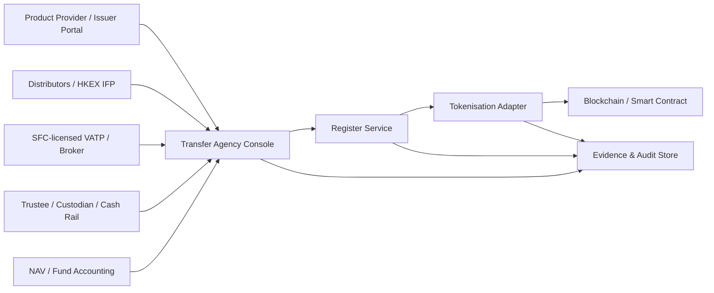

# SPEC - Hong Kong Transfer Agent Client

Date: 2026-05-08  
Scope: Hong Kong context, fund RWA / tokenised fund platform  
Status: Research-backed design draft

Related implementation specs:

- `05_Architecture/Specs/SPEC - Transfer Agency Data Contract and Synchronization.md`
- `03_Tickets/Active/TICKET - Hong Kong Transfer Agent Client UI.md`
- `04_User_Flows/FLOW - Hong Kong Transfer Agency Register Operations.md`

## 1. Executive Summary

The current project should refine its understanding of `Transfer Agent`.

In a Hong Kong fund context, `Transfer Agent` is best treated as a market-role label for the `registrar / fund administration transfer-agency function`, not as a standalone product owner that freely approves issuance, redemption, dividend, or payment events.

The core responsibility is:

> Keep the official holder / shareholder register accurate, support dealing and transfer processing, control register changes, reconcile register records against token and cash movements, and provide evidence that ownership records are complete, recoverable, and compliant.

For a tokenised SFC-authorised investment product, the Transfer Agent client should be built around:

- the official holder register
- wallet-to-investor mapping
- register versioning
- primary subscription / redemption posting
- secondary market transfer reconciliation, where enabled
- token ownership record controls
- exception handling and evidence packs

It should not be designed primarily as a generic "snapshot and payment-list generator".
Snapshots, dividend recipient lists, redemption payment lists, and audit logs are important, but they are derived from a controlled register.

## 2. Hong Kong Research Findings

### 2.1 Hong Kong usually says `registrar`, `share registrar`, or `fund administrator`

`Transfer agent` is a familiar international term, especially from US mutual fund and securities operations. In Hong Kong materials, the more precise wording depends on product type:

| Product / market | More common Hong Kong term | Transfer-agent function |
| --- | --- | --- |
| SFC-authorised unit trust / mutual fund | `registrar`, `trustee-appointed register keeper`, `fund administrator` | Maintain register of holders, process issue / redemption records, investor servicing |
| Hong Kong OFC | `register of shareholders` maintained by the OFC | Record shareholders, shares, sub-fund / class, paid amounts, changes and inspection rights |
| HK-listed equity | `share registrar` | Maintain register of members, handle physical share transfers, replacement certificates, dividends, corporate communications |
| Registered bond / note | `registrar`, `transfer agent`, `paying agent` under transaction documents | Register noteholders, process transfers / exchanges, support payments |
| Tokenised SFC-authorised fund | `Product Provider` remains responsible, service provider may perform registrar / TA functions | Maintain proper ownership records, reconcile tokens, support primary and approved secondary market operations |

Design implication: the UI may keep the role label `Transfer Agent` for demo clarity, but internal model and copy should use `Registrar / Transfer Agency` language where legal accuracy matters.

### 2.2 SFC UT Code: register of holders is mandatory

For SFC-authorised unit trusts and mutual funds:

- `Holder` means the person entered in the register as holder of the unit or share.
- The scheme, or for a unit trust the trustee or a person appointed by the trustee, must maintain a register of holders.
- The SFC can ask where the register is kept.
- Offering documents should disclose the registrar where applicable.

Design implication: the Transfer Agent client must treat the register as the primary operating object. Every subscription, redemption, transfer, and fund event should either propose, post, or reconcile a register delta.

### 2.3 OFC rules: shareholder register has statutory structure

For Hong Kong open-ended fund companies:

- An OFC must keep a register of shareholders.
- The register must include shareholder names and addresses, entry and cessation dates, shares held, sub-fund and share class where applicable, and amount paid / considered paid.
- The register must be kept at the registered office or another notified place in Hong Kong.
- Shareholders and specified persons have inspection / copy rights.
- The register is proof of required matters unless contrary evidence exists.

Design implication: for an OFC-style fund, the TA client needs fields beyond wallet address and token balance. It needs legal holder identity, address, class, sub-fund, issue / cessation timestamps, and evidence of amount paid.

### 2.4 SFC tokenised investment products: product provider remains ultimately responsible

The SFC's circular on tokenisation of SFC-authorised investment products was revised on 20 April 2026. It states that product providers remain ultimately responsible for:

- management and operational soundness of the tokenisation arrangement
- record keeping of ownership
- proper records of token holders' ownership interests
- operational compatibility with service providers
- cybersecurity, data privacy, outages, recovery, and business continuity
- demonstrating ownership record-keeping and smart contract integrity to the SFC

It also says product providers are not expected to issue tokenised SFC-authorised investment products in bearer form.

Design implication: the TA is an operator and control point, but responsibility cannot be fully outsourced to the TA system. The client must expose approval lineage: Product Provider approval, trustee / custodian dependencies, distributor input, TA maker-checker action, and system posting.

### 2.5 Tokenised securities circular: same business, same risks, same rules

The SFC's tokenised securities guidance says tokenised securities are traditional securities with a tokenisation wrapper. It highlights:

- ownership risk: how ownership interests are transferred and recorded
- technology risk: forks, network outages, cybersecurity, key loss, unauthorised transfers
- heightened risk for bearer-form tokenised securities on public-permissionless networks
- need for transfer limitations, smart contract audit disclosure, administrative controls, and BCP disclosure

Design implication: the TA client must include controls for:

- whitelist / permissioned transfer status
- transfer restriction enforcement
- lost key / compromised wallet recovery workflows
- burn and re-issue evidence
- chain reorg / outage incident workflow
- on-chain versus off-chain settlement finality status

### 2.6 Secondary trading: TA must support primary-secondary interoperability

The SFC circular on secondary trading of tokenised SFC-authorised investment products, dated 20 April 2026, is especially relevant for open-ended tokenised funds. It says product providers should:

- use best endeavours to arrange at least one market maker
- monitor secondary trading and liquidity
- appoint SFC-licensed distributors expected to process creation and redemption requests from third-party investors
- put arrangements with SFC-licensed VATPs to facilitate transfer across primary and secondary markets

It also requires clear disclosure of:

- trading channel
- settlement process and time
- pre-funding requirement
- differences between primary and secondary markets
- whether products are interchangeable across trading channels
- circumstances where secondary trading may be suspended

Design implication: if the platform supports secondary trading, the Transfer Agent client needs a `Primary / Secondary Bridge` module. It cannot stop at normal subscription and redemption batches.

### 2.7 HKEX Integrated Fund Platform confirms the ecosystem shape

HKEX's Integrated Fund Platform is available to fund managers, distributors, transfer agents, custodians, trustees, and fund administrators. Its business services include:

- fund repository
- order routing between fund distributors and fund managers / transfer agents
- communications among ecosystem participants

Design implication: Hong Kong fund distribution infrastructure sees transfer agents as part of an order-routing and post-trade processing ecosystem. A TA client should be integration-heavy and queue-driven.

## 3. Corrected Mental Model

### 3.1 What the Transfer Agent is

The Transfer Agent is:

- the operator of the official holder / shareholder register, if appointed to perform that function
- the processor of register-affecting instructions
- the reviewer of investor / wallet eligibility evidence before register posting
- the controller of book closure, record date, entitlement snapshot, and register versioning
- the reconciler between investor records, token balances, cash movements, and service-provider messages
- the producer of operational evidence for the product provider, trustee / custodian, auditors, and regulators

### 3.2 What the Transfer Agent is not

The Transfer Agent is not:

- the fund manager
- the investment decision-maker
- the legal issuer / product provider
- the distributor performing suitability and client onboarding, unless separately licensed and appointed
- the custodian of scheme assets, unless separately appointed
- the paying bank by default
- the party that can absorb the product provider's regulatory responsibility for token ownership records

### 3.3 Most important correction to the current project

The current project language sometimes implies:

> TA approves the workflow, then the chain action happens.

More accurate Hong Kong wording:

> TA verifies that a register delta is valid, posts or recommends the official register update under an approved mandate, reconciles the register against cash / token / order evidence, and records a controlled audit trail. Product Provider responsibility remains visible.

## 4. Role Boundary

| Function | Product Provider / Issuer | Transfer Agent / Registrar | Distributor / RI / LC | Trustee / Custodian | VATP / Broker |
| --- | --- | --- | --- | --- | --- |
| Product setup | Accountable | Receives setup data | May review distribution terms | Reviews custody / assets | Reviews listing / trading readiness |
| Investor onboarding | Accountable for framework | Stores status / evidence references | Performs KYC, suitability, selling controls | Usually not primary | Performs platform onboarding |
| Holder register | Accountable | Operates / maintains | Supplies investor data | May appoint / oversee for unit trust | Supplies platform holder / custody data |
| Subscription order | Accountable | Validates and posts register delta | Collects / submits order | Confirms cash / custody as applicable | Not primary, unless secondary bridge |
| Redemption order | Accountable | Validates holdings and posts redemption delta | Collects / submits order | Confirms payment / custody as applicable | May route primary redemption from secondary holders |
| Secondary transfer | Accountable for arrangement | Reconciles ownership movement and register | May connect client orders | Custody input | Executes / reports trades |
| Dividend / distribution | Declares event and funds | Locks record date, derives recipient list | Communicates to clients | Confirms assets / cash as applicable | Usually not primary |
| Regulatory evidence | Accountable | Produces register and control evidence | Produces distribution evidence | Produces custody evidence | Produces trading evidence |

## 5. Product Definition

### 5.1 Client name

Recommended UI name:

`Transfer Agency Console`

Alternative if the demo must keep the older vocabulary:

`Transfer Agent Desk`

Recommended subtitle:

`Register, dealing, transfer, and reconciliation controls`

### 5.2 User goal

The TA operator wants to:

1. Clear today's register-affecting work queue.
2. Ensure no unit / share movement is posted without valid investor, cash, token, and approval evidence.
3. Produce a defensible register version and audit pack at any time.

### 5.3 Primary action

The primary action is not `Approve`.

Use:

- `Review Register Delta`
- `Post Register Update`
- `Resolve Break`
- `Lock Record Date`
- `Release Register Version`

### 5.4 Information hierarchy

1. Register health and exceptions
2. Work queue requiring TA action
3. Fund / class register view
4. Dealing cycle and batch details
5. Token and cash reconciliation
6. Audit / evidence export

### 5.5 Visual direction

Dense Hong Kong fund-ops console:

- table-first
- queue-first
- restrained financial operations aesthetic
- clear status badges and exception severity
- no marketing hero
- no text-heavy explainer

## 6. Recommended Navigation

### 6.1 Global sections

| Section | Purpose |
| --- | --- |
| `Dashboard` | Today's register health, urgent exceptions, pending postings |
| `Work Queue` | All TA tasks across funds, grouped by SLA and risk |
| `Holder Register` | Official register, versions, holder accounts, wallet links |
| `Dealing Cycles` | Subscription / redemption batches and NAV-based posting |
| `Transfers` | Primary-secondary transfers, wallet changes, restrictions |
| `Fund Events` | Record dates, dividends / distributions, meetings, notices |
| `Reconciliation` | Register vs token vs cash vs order system breaks |
| `Evidence` | Audit trail, exported packs, SFC / auditor readiness |
| `Controls` | Maker-checker rules, permissions, BCP, smart-contract controls |

### 6.2 Dashboard layout

Top strip:

- `Register Versions Released Today`
- `Pending Register Deltas`
- `Unreconciled Token Breaks`
- `Cash Pending Before Posting`
- `Blocked Transfers`

Main body:

- Left: queue table with priority, SLA, fund, class, task type, next action
- Right: exception rail with token / cash / identity / approval breaks
- Bottom: recent register versions and audit events

### 6.3 Work Queue task types

| Task type | Example next action |
| --- | --- |
| `Investor Onboarding` | verify distributor evidence and wallet binding |
| `Subscription Posting` | match cash, NAV, unit calculation, then post register delta |
| `Redemption Posting` | reserve units, validate NAV / gate / payment, then post cancellation |
| `Wallet Change` | verify holder instruction and update wallet mapping |
| `Secondary Transfer` | reconcile VATP trade / custody movement / register update |
| `Record Date` | close register and freeze eligible holder snapshot |
| `Distribution` | derive entitlement list and reconcile payout status |
| `Exception` | resolve mismatch before register release |

## 7. Core Data Model

### 7.1 Fund and class

```ts
type FundProduct = {
  fundId: string;
  productProviderId: string;
  legalForm: "Unit Trust" | "OFC" | "Mutual Fund Corporation" | "Other";
  sfcAuthorised: boolean;
  tokenised: boolean;
  tokenisationApprovalStatus: "Not Applicable" | "Prior Consultation" | "Approved" | "Material Change Pending";
  registrarAppointment: ServiceProviderAppointment;
};

type FundClass = {
  classId: string;
  fundId: string;
  className: string;
  currency: string;
  tokenContractAddress?: string;
  transferMode: "Non-transferable" | "Permissioned Transfer" | "VATP Secondary Trading";
  onChainSettlementFinality: "Final" | "Operational Only" | "Depends On Register Posting";
  officialRecordSource: "Off-chain Register" | "On-chain Register" | "Hybrid Register";
};
```

### 7.2 Holder and register account

```ts
type Holder = {
  holderId: string;
  legalName: string;
  registeredAddress: string;
  holderType: "Individual" | "Corporate" | "Nominee" | "Distributor Omnibus" | "VATP Omnibus";
  jurisdiction: string;
  kycStatus: "Not Received" | "Received" | "Cleared" | "Expired" | "Rejected";
  suitabilityStatus?: "Distributor Confirmed" | "Not Applicable" | "Exception";
  taxStatus?: string;
};

type RegisterAccount = {
  registerAccountId: string;
  fundId: string;
  classId: string;
  holderId: string;
  accountStatus: "Active" | "Restricted" | "Suspended" | "Closed";
  openedAt: string;
  ceasedAt?: string;
  source: "TA Direct" | "Distributor" | "HKEX IFP" | "VATP" | "Migration";
};
```

### 7.3 Wallet mapping

```ts
type WalletLink = {
  walletLinkId: string;
  registerAccountId: string;
  walletAddress: string;
  chainId: string;
  status: "Pending Verification" | "Active" | "Suspended" | "Revoked";
  proofType: "Personal Sign" | "Distributor Attestation" | "Custodian Attestation" | "VATP Attestation";
  verifiedAt?: string;
  transferWhitelistStatus: "Whitelisted" | "Not Whitelisted" | "Removed";
};
```

### 7.4 Register version and delta

```ts
type RegisterVersion = {
  registerVersionId: string;
  fundId: string;
  classId: string;
  effectiveAt: string;
  releasedAt?: string;
  status: "Draft" | "Pending Checker" | "Released" | "Superseded" | "Voided";
  previousVersionId?: string;
  totalUnits: string;
  totalHolders: number;
  hash: string;
  releasedBy?: string;
};

type RegisterDelta = {
  deltaId: string;
  registerVersionId?: string;
  fundId: string;
  classId: string;
  registerAccountId: string;
  deltaType: "Issue" | "Redeem" | "Transfer In" | "Transfer Out" | "Wallet Change" | "Restriction" | "Correction";
  units: string;
  reasonCode: string;
  sourceInstructionId: string;
  makerStatus: "Draft" | "Submitted";
  checkerStatus: "Pending" | "Approved" | "Rejected";
  postingStatus: "Not Posted" | "Posted" | "Reversed";
};
```

### 7.5 Reconciliation break

```ts
type ReconciliationBreak = {
  breakId: string;
  fundId: string;
  classId: string;
  severity: "Low" | "Medium" | "High" | "Critical";
  breakType:
    | "RegisterVsToken"
    | "RegisterVsCash"
    | "OrderVsRegister"
    | "WalletNotMapped"
    | "RestrictedTransfer"
    | "NAVMismatch"
    | "DuplicateInstruction";
  description: string;
  detectedAt: string;
  owner: "Transfer Agent" | "Product Provider" | "Distributor" | "Custodian" | "VATP" | "System";
  status: "Open" | "Under Review" | "Resolved" | "Waived";
};
```

## 8. Workflow Design

Current demo route model:

| TA capability | Route | Purpose |
| --- | --- | --- |
| Console | `/ta` | Daily register health, workflow summary, exceptions, evidence entry |
| Workflow queue | `/ta/queue` | Pull issuer-originated workflow tasks |
| Workflow detail | `/ta/queue/:taskId` | Review-gated approval page for respond, match, snapshot/list, issuer review, and close-out |
| Book of Record | `/ta/register` | Search who owns which assets, wallet links, restrictions, register versions |
| Exceptions | `/ta/reconciliation` | Resolve or waive reconciliation breaks |
| Evidence | `/ta/evidence` | Inspect evidence packs and hash anchors |

Implementation note:

- The TA client is now a dedicated interface, not a hidden service call inside issuer pages.
- Each browser tab can run a different simulated role; issuer and TA state sync through the mock workflow backend.
- Distribution and redemption actions that need TA feedback should create or repair a `WorkflowInstance`, then wait for the TA workflow to submit output back to issuer review.

### 8.1 Investor onboarding and wallet binding

State flow:

1. `Received`
2. `Distributor / KYC Evidence Attached`
3. `Register Account Created`
4. `Wallet Proof Verified`
5. `Transfer Whitelist Updated`
6. `Active`

TA action:

- review identity / account evidence references
- bind holder to register account
- bind approved wallet to register account
- ensure wallet address is whitelisted only after account status is active

Important control:

- The TA client should not perform suitability itself unless that entity is also appointed and licensed for that function.
- The UI should show who supplied KYC / suitability evidence.

### 8.2 Primary subscription

State flow:

1. `Order Received`
2. `Cash Pending`
3. `Cash Matched`
4. `NAV Pending`
5. `Units Calculated`
6. `Register Delta Pending`
7. `Token Mint / Allocation Pending`
8. `Register Posted`
9. `Reconciled`

TA action:

- verify account and wallet eligibility
- confirm cash status from issuer / custodian / payment rail
- check forward pricing and unit calculation
- prepare issue delta
- perform maker-checker posting
- reconcile minted tokens and register holdings

Do not let the TA post units if:

- cash is not confirmed, where pre-funding is required
- KYC / suitability evidence is missing
- wallet is not active / whitelisted
- NAV is not final
- token mint event mismatches register delta

### 8.3 Primary redemption

State flow:

1. `Order Received`
2. `Units Reserved`
3. `NAV Pending`
4. `Cash Amount Calculated`
5. `Payment Instruction Ready`
6. `Token Burn / Cancellation Pending`
7. `Register Posted`
8. `Payment Reconciled`
9. `Closed`

TA action:

- verify holder balance
- enforce cut-off, gate, notice, lock-up, suspension
- reserve units or mark them pending cancellation
- prepare redemption delta
- reconcile payment reference and burn / cancellation evidence

Payment responsibility:

- The TA may generate or validate the payment list, but cash execution may belong to issuer, trustee / custodian, paying bank, or another provider.
- The UI must show the payment owner separately from the register owner.

### 8.4 Secondary market transfer

Only applies if approved / enabled for the fund class.

State flow:

1. `VATP / Broker Trade Report Received`
2. `Eligibility and Transferability Checked`
3. `Token Movement Observed`
4. `Register Delta Prepared`
5. `Register Posted`
6. `Primary-Secondary Position Reconciled`

TA action:

- check whether source and destination are valid registered / omnibus holders
- check transfer restrictions and suspension status
- reconcile VATP position, on-chain movement, and register entries
- identify whether token purchased in secondary market can be redeemed in primary market

Required UI objects:

- `Trading Channel`
- `VATP`
- `Market Maker`
- `Omnibus Holder`
- `Position Source`
- `Primary Redeemability`
- `Suspension Linkage`

### 8.5 Record date and distribution

State flow:

1. `Event Approved by Product Provider`
2. `Record Date Scheduled`
3. `Register Closed / Book Closed`
4. `Snapshot Locked`
5. `Entitlement Calculated`
6. `Payment / Distribution Status Updated`
7. `Reconciled`

TA action:

- lock a register version at record date
- derive eligible holders and units
- generate entitlement list
- reconcile paid / unpaid / failed records

Important correction:

- The eligibility list should be a deterministic output from the register and event terms, not a manually curated investor rule list.

### 8.6 Register correction

State flow:

1. `Correction Request`
2. `Evidence Attached`
3. `Impact Analysis`
4. `Product Provider Approval`
5. `TA Checker Approval`
6. `Correction Delta Posted`
7. `Audit Pack Released`

High-risk examples:

- duplicate holder account
- wrong wallet binding
- on-chain transfer without valid register basis
- lost key burn and re-issue
- post-finality NAV or unit correction

## 9. Controls and Permissions

### 9.1 Maker-checker

Every register-affecting action requires:

- maker
- checker
- reason code
- source instruction
- evidence attachment or evidence reference
- resulting register delta hash

### 9.2 Role permissions

| Role | Can do |
| --- | --- |
| `TA Maker` | prepare deltas, attach evidence, propose register changes |
| `TA Checker` | approve / reject deltas and release register versions |
| `TA Supervisor` | override SLA, approve corrections, export evidence packs |
| `Product Provider Viewer` | view register status and TA actions |
| `Product Provider Approver` | approve product-level events or corrections before TA posting |
| `Distributor Viewer` | view submitted investors / orders only |
| `Custodian Viewer` | provide or confirm cash / custody references |
| `Auditor / Regulator Read-only` | view immutable evidence packs |

### 9.3 System controls

- immutable audit log
- register version hash
- chain event hash
- evidence file hash
- four-eyes approval
- segregation of duties
- SLA alerts
- data retention policy
- PDPO-aware access control
- BCP mode for chain / node outage
- suspension switch for primary dealing and secondary trading

## 10. Integration Architecture



### 10.1 Backend synchronization principle

The Transfer Agent client must not have a separate backend truth from the Issuer client.

Use one canonical backend model and expose role-specific projections:

- Issuer projection: product lifecycle, Product Provider approvals, cash readiness, TA register status, open breaks.
- Transfer Agent projection: work queue, register deltas, register versions, reconciliation breaks, evidence.
- Investor projection: order status, payment status, booked holdings, settlement status.

The synchronization hinge is `RegisterDelta`.

Issuer actions create business instructions.
TA actions prepare, approve, and post register deltas.
Investor holdings and issuer lifecycle status are derived from the same register version and reconciliation events.

Detailed data contract:

- `05_Architecture/Specs/SPEC - Transfer Agency Data Contract and Synchronization.md`

### 10.2 Services

| Service | Responsibility |
| --- | --- |
| `Register Service` | holder accounts, holdings, register versions, deltas |
| `Instruction Service` | subscriptions, redemptions, transfers, wallet changes |
| `Eligibility Service` | KYC / suitability status references, restrictions, whitelist readiness |
| `Tokenisation Adapter` | contract events, mint / burn / transfer instructions, whitelist updates |
| `Reconciliation Service` | compare orders, register, token, cash, NAV |
| `Event Service` | record dates, distributions, meetings, notices |
| `Evidence Service` | immutable audit logs, source documents, evidence packs |
| `Notification Service` | SLA, break, suspension, posting, investor / provider notifications |

### 10.3 Integration endpoints

Inbound:

- distributor order file / API
- HKEX IFP order routing, if adopted
- VATP trade / transfer reports
- custodian cash confirmation
- NAV official value
- issuer-approved event instructions
- blockchain event listener

Outbound:

- register posting confirmation
- token whitelist / mint / burn instructions
- exception reports
- distribution / payment list
- SFC / auditor evidence pack
- provider dashboard status

## 11. Page-Level Design

### 11.1 Dashboard

Primary content:

- `Register Health`
- `Pending Postings`
- `Open Breaks`
- `Suspension Status`
- `Latest Register Versions`

Primary CTA:

- `Open Work Queue`

### 11.2 Work Queue

Table columns:

- Priority
- SLA
- Fund
- Class
- Task type
- Source
- Register impact
- Blocking issue
- Owner
- Next action

Row detail drawer:

- source instruction
- required evidence
- current register position
- token position
- cash / NAV status
- maker-checker timeline

### 11.3 Holder Register

Tabs:

- `Current Register`
- `Register Versions`
- `Holder Accounts`
- `Wallet Links`
- `Restrictions`
- `Corrections`

Core table columns:

- Holder
- Register account
- Fund / class
- Units / shares
- Wallet
- Status
- Source
- Last delta
- Last reconciled

### 11.4 Dealing Cycle

Tabs:

- `Orders`
- `Cash`
- `NAV`
- `Unit Calculation`
- `Register Deltas`
- `Reconciliation`

CTA:

- `Prepare Register Delta`
- `Post Register Update`
- `Export Cycle Evidence`

### 11.5 Transfers

Tabs:

- `Wallet Changes`
- `Primary-Secondary Bridge`
- `Restricted Transfers`
- `Lost Key / Recovery`
- `Suspensions`

Key visual:

- a three-way reconciliation strip: `VATP / Broker` vs `Token` vs `Register`

### 11.6 Fund Events

Tabs:

- `Record Date`
- `Snapshot`
- `Entitlements`
- `Payment Status`
- `Reconciliation`

CTA:

- `Lock Record Date`
- `Release Entitlement List`
- `Close Event`

### 11.7 Evidence

Filters:

- Fund
- Class
- Date range
- Register version
- Event type
- Operator

Evidence pack contents:

- source instructions
- register before / after
- approval trail
- token event hashes
- cash references
- reconciliation result
- exceptions and waivers
- export timestamp and hash

## 12. Implementation Notes for Existing Demo

### 12.1 Rename and reframe

Keep visible demo role:

- `Transfer Agent`

Add operational label in panels:

- `Registrar / Transfer Agency`

Change wording:

- `Transfer Agent approves allocation` -> `TA posts register delta after allocation approval`
- `Transfer Agent confirms cash` -> `Cash confirmed by custodian / operations; TA uses confirmation for register posting`
- `Transfer Agent generated payment list` -> `Payment list derived from TA-controlled register snapshot`

### 12.2 Add data fields

At minimum:

- `officialRecordSource`
- `registerVersionId`
- `registerEffectiveAt`
- `holderId`
- `registerAccountId`
- `registeredAddress`
- `walletLinkStatus`
- `tokenSettlementFinality`
- `productProviderApprovalStatus`
- `cashEvidenceOwner`
- `reconciliationBreaks`
- `primarySecondaryTransferStatus`

### 12.3 Add pages incrementally

Phase 1:

- TA Dashboard
- Work Queue
- Holder Register

Phase 2:

- Dealing Cycle detail
- Register Delta drawer
- Reconciliation breaks

Phase 3:

- Secondary transfer bridge
- BCP / incident controls
- Evidence pack export

### 12.4 Demo scenarios

Use four scenarios:

1. `Clean subscription posting`
   - cash matched
   - NAV confirmed
   - wallet whitelisted
   - register delta posted
   - token mint reconciled

2. `Blocked subscription`
   - order received
   - cash present
   - wallet not bound
   - TA cannot post register delta

3. `Secondary market bridge`
   - VATP trade report received
   - token moved to VATP omnibus
   - register update pending
   - break resolved after confirmation

4. `Record-date distribution`
   - product provider declares event
   - TA locks register version
   - entitlement list generated
   - payment owner confirms payout
   - TA reconciles event

## 13. Open Questions

1. Is the product meant to be an SFC-authorised public fund, private fund, OFC, unit trust, or tokenised bond?
2. Is the token meant to be a legal title record, beneficial ownership record, or operational mirror of the off-chain register?
3. Does the fund support secondary trading on an SFC-licensed VATP, or only primary subscription / redemption?
4. Who is legally appointed as registrar / transfer agent: trustee, fund administrator, issuer affiliate, or external service provider?
5. Who owns cash confirmation: issuer operations, trustee / custodian, bank, stablecoin custodian, or TA?
6. Does the platform need to support omnibus accounts for distributors / VATPs?
7. What is the BCP model for chain outage, key compromise, and erroneous token transfer?
8. What evidence pack must be shown in demo: internal audit only, SFC-readiness, trustee review, or investor-facing confirmation?

## 14. Recommended Product Decision

For the Hong Kong demo, model the Transfer Agent client as:

> a registrar-grade operations console for controlled register updates and token ownership reconciliation.

Do not model it as:

> a generic external approver that approves every issuer workflow step.

The best architecture is a hybrid register model:

- off-chain register remains authoritative unless offering documents and legal opinions say otherwise
- on-chain token balances are reconciled operational records
- wallet mappings are controlled extensions of registered holder accounts
- every token movement that affects investor rights must be explainable as a register delta or a pending exception

This is more aligned with Hong Kong's fund, OFC, share registrar, and SFC tokenisation expectations.

## 15. Source Links

- SFC, `Circular on tokenisation of SFC-authorised investment products`, revised 20 Apr 2026: https://apps.sfc.hk/edistributionWeb/api/circular/openFile?lang=EN&refNo=26EC22
- SFC, `Circular on secondary trading of tokenised SFC-authorised investment products`, 20 Apr 2026: https://apps.sfc.hk/edistributionWeb/api/circular/openFile?lang=EN&refNo=26EC23
- SFC, `Circular on intermediaries engaging in tokenised securities-related activities`, 2 Nov 2023: https://apps.sfc.hk/edistributionWeb/api/circular/openFile?lang=EN&refNo=23EC52
- SFC, `SFC Handbook for Unit Trusts and Mutual Funds`: https://www.sfc.hk/-/media/EN/assets/components/codes/files-current/web/codes/sfc-handbook-for-unit-trusts-and-mutual-funds/sfc-handbook-for-unit-trusts-and-mutual-funds.pdf
- SFC, `Code on Open-ended Fund Companies`: https://www.sfc.hk/-/media/EN/assets/components/codes/files-current/web/codes/code-on-open-ended-fund-companies/code-on-open-ended-fund-companies.pdf
- Companies Registry, `Securities and Futures (Open-ended Fund Companies) Rules` gazette PDF: https://www.cr.gov.hk/en/ofc/docs/GN20180518_2997-e.pdf
- HKEX, `Integrated Fund Platform`: https://www.hkex.com.hk/Services/Platform-Services/Integrated-Fund-Platform?sc_lang=en
- HKEX, `HKEX Launches Fund Repository on Integrated Fund Platform`, 3 Jul 2025: https://www.hkex.com.hk/News/News-Release/2025/250703news?sc_lang=en
- HKEX, `Main Board Listing Rules, Chapter 13 registration services and record date`: https://en-rules.hkex.com.hk/entiresection/2597
- HKEX FAQ, share registrar description: https://www.hkex.com.hk/Global/Exchange/FAQ/Getting-Started?sc_lang=en
