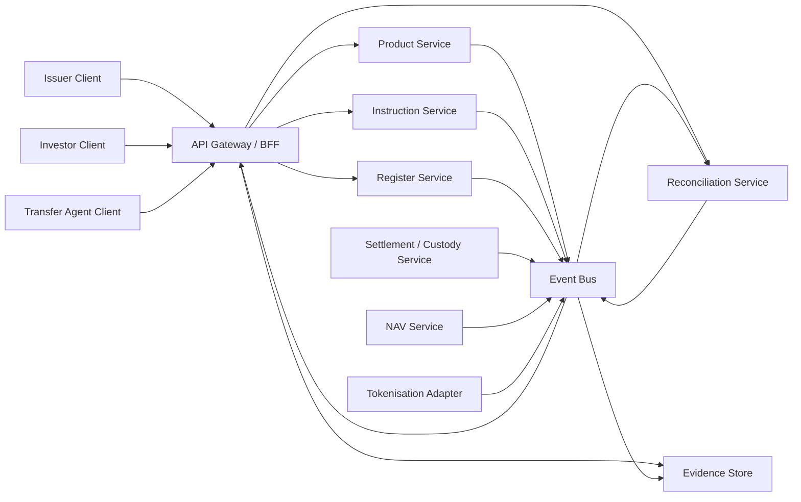
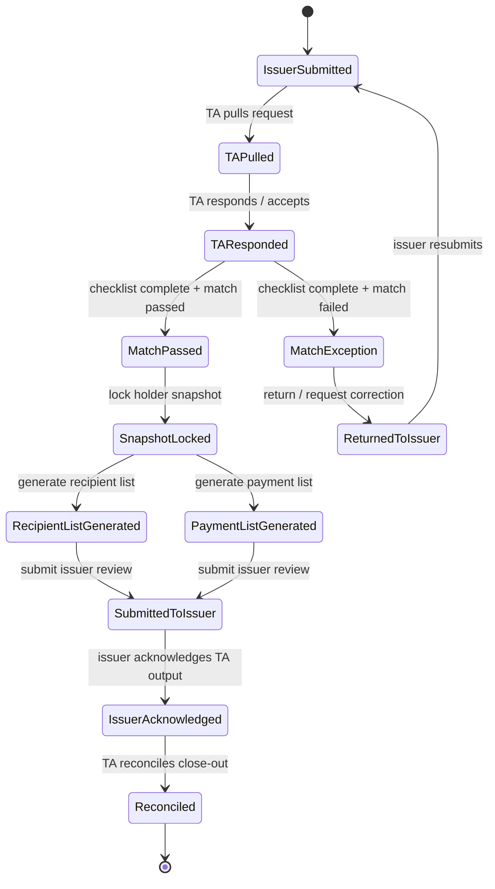
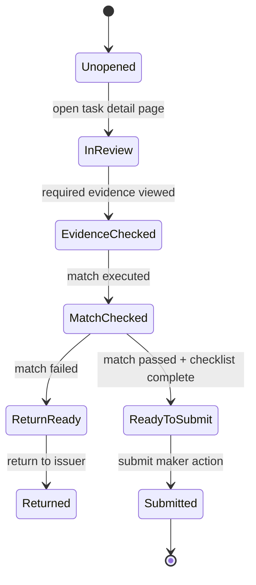

# SPEC - Transfer Agency Data Contract and Synchronization

Date: 2026-05-08  
Scope: backend data model and synchronization contract for Issuer, Investor, and Transfer Agent clients  
Related:

- `05_Architecture/Specs/SPEC - Hong Kong Transfer Agent Client.md`
- `03_Tickets/Active/TICKET - Hong Kong Transfer Agent Client UI.md`
- `04_User_Flows/FLOW - Hong Kong Transfer Agency Register Operations.md`

## 1. Purpose

The Transfer Agent client cannot be designed only as a frontend role.

The system needs a shared backend contract so that:

- Issuer / Product Provider sees the same operational truth as TA.
- TA does not maintain a private shadow status.
- Investor-facing status is derived from the same register and settlement events.
- Token events, cash evidence, NAV, and register postings reconcile into one lifecycle.
- Every register-affecting action is auditable and idempotent.

Without this layer, the platform can easily show inconsistent states:

- Issuer side: `Issuance Completed`
- TA side: `Register Delta Pending`
- Investor side: `Units Received`
- Chain side: `Mint event emitted`
- Cash side: `Cash not matched`

That mismatch is exactly what the Transfer Agency design must prevent.

## 2. Core Principle

Use a single canonical backend domain model.

Do not create separate backend objects for `IssuerOrder`, `TransferAgentOrder`, and `InvestorOrder`.

Instead:

> One instruction, one register delta lifecycle, multiple role-specific projections.

The frontend clients should read different projections of the same source records:

- Issuer client reads product, lifecycle, funding, and provider approval views.
- TA client reads register, delta, reconciliation, and evidence views.
- Investor client reads order, holding, cash, and investor confirmation views.

## 3. Source of Truth

| Domain | System of record | Notes |
| --- | --- | --- |
| Product definition | Product Service | fund terms, class terms, tokenisation arrangement |
| Investor identity / suitability | Distributor / Onboarding Service | TA stores evidence reference, not full regulated onboarding logic |
| Official holder register | Register Service | authoritative register unless legal documents say on-chain register is authoritative |
| Orders / instructions | Instruction Service | subscription, redemption, transfer, wallet change |
| Cash status | Settlement / Custody Service | TA consumes confirmation, should not invent cash finality |
| NAV | Valuation / Fund Accounting Service | official NAV is required before final units / cash amounts |
| Token events | Tokenisation Adapter | mint, burn, transfer, whitelist, recovery events |
| Reconciliation breaks | Reconciliation Service | cross-domain exception source |
| Evidence | Evidence Store | immutable event, file, hash, and approval trail |

## 4. Backend Context Diagram



## 5. Data Ownership Rules

### 5.1 Product Provider / Issuer owns business intent

Issuer can create or approve:

- product setup
- fund class terms
- subscription window
- redemption event
- distribution event
- pause / resume instruction
- correction approval

Issuer cannot directly mutate:

- official register balances
- TA checker approval
- register version hash
- token event record
- reconciliation break closure

### 5.2 Transfer Agent owns register operations

TA can create or mutate:

- register account
- wallet link status
- register delta draft
- register delta maker / checker status
- register version release
- register restriction
- register correction proposal
- reconciliation break workflow
- evidence pack export

TA should not be sole source of truth for:

- Product Provider approval
- investor suitability
- cash finality
- official NAV
- market maker performance
- VATP trade execution

### 5.3 Investor owns investor instructions

Investor can create:

- subscription order intent
- redemption order intent
- wallet proof
- distribution election, if supported

Investor cannot directly mutate:

- order acceptance
- NAV
- register posting
- token mint / burn
- settlement status

## 6. Canonical Entity Model

### 6.1 Product and class

```ts
type Product = {
  productId: string;
  productProviderId: string;
  legalName: string;
  legalForm: "UnitTrust" | "OFC" | "MutualFundCorporation" | "Bond" | "Other";
  jurisdiction: "HK" | string;
  sfcAuthorised: boolean;
  status: "Draft" | "PendingApproval" | "Approved" | "Active" | "Paused" | "Terminated";
  createdAt: string;
  updatedAt: string;
  version: number;
};

type ProductClass = {
  classId: string;
  productId: string;
  className: string;
  currency: string;
  tokenised: boolean;
  tokenContractAddress?: string;
  tokenDecimals?: number;
  officialRecordSource: "OffChainRegister" | "OnChainRegister" | "HybridRegister";
  transferMode: "NonTransferable" | "PermissionedTransfer" | "VATPSecondaryTrading";
  primaryDealingStatus: "NotOpen" | "Open" | "Paused" | "Suspended";
  secondaryTradingStatus?: "NotEnabled" | "PendingApproval" | "Enabled" | "Suspended";
  version: number;
};
```

### 6.2 Investor, holder, and register account

```ts
type InvestorProfile = {
  investorId: string;
  displayName: string;
  investorType: "Individual" | "Corporate" | "Institutional" | "Nominee" | "Omnibus";
  jurisdiction: string;
  onboardingStatus: "NotStarted" | "Pending" | "Cleared" | "Expired" | "Rejected";
  suitabilityStatus?: "NotRequired" | "Pending" | "Confirmed" | "Rejected";
  evidenceRefIds: string[];
  version: number;
};

type Holder = {
  holderId: string;
  investorId?: string;
  legalName: string;
  registeredAddress: string;
  holderType: "Direct" | "Nominee" | "DistributorOmnibus" | "VATPOmnibus";
  status: "Active" | "Restricted" | "Suspended" | "Closed";
  createdAt: string;
  version: number;
};

type RegisterAccount = {
  registerAccountId: string;
  productId: string;
  classId: string;
  holderId: string;
  accountStatus: "Pending" | "Active" | "Restricted" | "Suspended" | "Closed";
  openedAt?: string;
  ceasedAt?: string;
  source: "Direct" | "Distributor" | "HKEXIFP" | "VATP" | "Migration";
  version: number;
};
```

### 6.3 Wallet link

```ts
type WalletLink = {
  walletLinkId: string;
  registerAccountId: string;
  walletAddress: string;
  chainId: string;
  proofStatus: "Missing" | "Submitted" | "Verified" | "Rejected" | "Expired";
  whitelistStatus: "NotRequired" | "Pending" | "Whitelisted" | "Removed" | "Suspended";
  proofRefId?: string;
  verifiedAt?: string;
  version: number;
};
```

### 6.4 Instruction

`Instruction` is the shared object behind orders, issuer actions, TA tasks, wallet changes, and transfer reports.

```ts
type Instruction = {
  instructionId: string;
  instructionType:
    | "Subscription"
    | "Redemption"
    | "Transfer"
    | "WalletChange"
    | "DistributionEvent"
    | "RecordDate"
    | "RegisterCorrection"
    | "PauseResume"
    | "TokenRecovery";
  productId: string;
  classId: string;
  sourceActorType: "Investor" | "Issuer" | "Distributor" | "TransferAgent" | "Custodian" | "VATP" | "System";
  sourceActorId: string;
  sourceChannel: "IssuerPortal" | "InvestorPortal" | "TAConsole" | "DistributorAPI" | "VATPAPI" | "BatchUpload" | "System";
  sourceReference?: string;
  idempotencyKey: string;
  status:
    | "Received"
    | "PendingEvidence"
    | "PendingApproval"
    | "ReadyForRegisterReview"
    | "RegisterDeltaPrepared"
    | "RegisterPosted"
    | "Rejected"
    | "Cancelled"
    | "Reconciled";
  evidenceRefIds: string[];
  createdAt: string;
  updatedAt: string;
  version: number;
};
```

### 6.5 Register delta

`RegisterDelta` is the main synchronization object between Issuer and TA clients.

```ts
type RegisterDelta = {
  deltaId: string;
  instructionId: string;
  productId: string;
  classId: string;
  registerAccountId: string;
  deltaType:
    | "Issue"
    | "Redeem"
    | "TransferIn"
    | "TransferOut"
    | "WalletChange"
    | "Restriction"
    | "Correction";
  units: string;
  navRefId?: string;
  cashRefId?: string;
  tokenEventRefId?: string;
  reasonCode: string;
  makerId?: string;
  checkerId?: string;
  makerStatus: "Draft" | "Submitted";
  checkerStatus: "NotRequired" | "Pending" | "Approved" | "Rejected";
  postingStatus: "NotPosted" | "Posting" | "Posted" | "Reversed" | "Failed";
  effectiveAt?: string;
  postedAt?: string;
  previousRegisterVersionId?: string;
  newRegisterVersionId?: string;
  idempotencyKey: string;
  createdAt: string;
  updatedAt: string;
  version: number;
};
```

### 6.6 Register version

```ts
type RegisterVersion = {
  registerVersionId: string;
  productId: string;
  classId: string;
  status: "Draft" | "PendingChecker" | "Released" | "Superseded" | "Voided";
  effectiveAt: string;
  releasedAt?: string;
  previousRegisterVersionId?: string;
  totalHolders: number;
  totalUnits: string;
  registerHash: string;
  deltaIds: string[];
  releasedBy?: string;
  createdAt: string;
  version: number;
};
```

### 6.7 Cash, NAV, token events

```ts
type CashMovement = {
  cashMovementId: string;
  instructionId: string;
  productId: string;
  classId: string;
  direction: "In" | "Out";
  amount: string;
  currency: string;
  status: "Expected" | "ProofUploaded" | "Matched" | "Confirmed" | "Failed" | "Reversed";
  owner: "IssuerOps" | "Custodian" | "Bank" | "StablecoinCustodian" | "TransferAgent";
  reference?: string;
  confirmedAt?: string;
  version: number;
};

type NavRecord = {
  navRefId: string;
  productId: string;
  classId: string;
  navDate: string;
  navValue: string;
  currency: string;
  status: "Draft" | "Official" | "Corrected" | "Voided";
  publishedAt?: string;
  version: number;
};

type TokenEvent = {
  tokenEventRefId: string;
  productId: string;
  classId: string;
  eventType: "Mint" | "Burn" | "Transfer" | "Whitelist" | "Recover" | "Pause" | "Unpause";
  chainId: string;
  txHash?: string;
  blockNumber?: number;
  fromAddress?: string;
  toAddress?: string;
  amount?: string;
  status: "Observed" | "Confirmed" | "Finalized" | "Rejected" | "Reorged";
  linkedDeltaId?: string;
  createdAt: string;
  version: number;
};
```

### 6.8 Reconciliation break

```ts
type ReconciliationBreak = {
  breakId: string;
  productId: string;
  classId: string;
  instructionId?: string;
  registerDeltaId?: string;
  severity: "Low" | "Medium" | "High" | "Critical";
  breakType:
    | "RegisterVsToken"
    | "RegisterVsCash"
    | "OrderVsRegister"
    | "WalletNotMapped"
    | "RestrictedTransfer"
    | "NAVMismatch"
    | "DuplicateInstruction"
    | "ApprovalMissing";
  status: "Open" | "Assigned" | "UnderReview" | "Resolved" | "Waived";
  ownerRole: "Issuer" | "TransferAgent" | "Distributor" | "Custodian" | "VATP" | "System";
  resolutionRefId?: string;
  detectedAt: string;
  resolvedAt?: string;
  version: number;
};
```

### 6.9 Evidence record

```ts
type EvidenceRecord = {
  evidenceRefId: string;
  productId?: string;
  classId?: string;
  instructionId?: string;
  registerDeltaId?: string;
  evidenceType:
    | "OfferingDocument"
    | "ProductProviderApproval"
    | "KYCReference"
    | "SuitabilityReference"
    | "CashConfirmation"
    | "NAVPublication"
    | "TokenEvent"
    | "RegisterVersion"
    | "ReconciliationReport"
    | "Waiver"
    | "CorrectionMemo";
  storageUri?: string;
  contentHash?: string;
  sourceActorType: Instruction["sourceActorType"];
  sourceActorId: string;
  createdAt: string;
  retentionClass: "Operational" | "Audit" | "Regulatory";
  version: number;
};
```

### 6.10 Workflow instance

`WorkflowInstance` is the missing transaction layer between business intent and TA register work.
It is not the same object as `Instruction`.

- `Instruction` records what business event or register-impacting request exists.
- `WorkflowInstance` records who must review it, which approval stage it is in, and whether the next action is allowed.

```ts
type WorkflowInstance = {
  workflowId: string;
  workflowType:
    | "SubscriptionRegisterPosting"
    | "DistributionHandoff"
    | "RedemptionHandoff"
    | "RegisterCorrection"
    | "SecondaryTransfer";
  instructionId: string;
  sourceReference?: string;
  productId: string;
  classId: string;
  status:
    | "IssuerSubmitted"
    | "TAPulled"
    | "TAResponded"
    | "MatchPassed"
    | "MatchException"
    | "ReturnedToIssuer"
    | "SnapshotLocked"
    | "RecipientListGenerated"
    | "PaymentListGenerated"
    | "SubmittedToIssuer"
    | "IssuerAcknowledged"
    | "Reconciled"
    | "Cancelled";
  currentTaskId?: string;
  currentOwnerRole: "Issuer" | "TransferAgent" | "Distributor" | "Custodian" | "System";
  idempotencyKey: string;
  createdAt: string;
  updatedAt: string;
  version: number;
};
```

### 6.11 Workflow task

`WorkflowTask` is the object behind a TA Work Queue row.
A task row should open a dedicated review page; it should not execute the next command directly from the table.

```ts
type WorkflowTask = {
  taskId: string;
  workflowId: string;
  instructionId: string;
  taskType:
    | "TARespond"
    | "MatchData"
    | "LockSnapshot"
    | "GenerateList"
    | "SubmitIssuerReview"
    | "IssuerAcknowledge"
    | "ReconcileCloseOut"
    | "ResolveBreak";
  ownerRole: "Issuer" | "TransferAgent" | "Distributor" | "Custodian" | "System";
  ownerUserId?: string;
  status:
    | "New Request"
    | "Awaiting Pull"
    | "Match Required"
    | "Ready For Approval"
    | "Awaiting Issuer"
    | "Ready To Reconcile"
    | "Returned"
    | "Completed"
    | "Blocked";
  requiredReviewItems: string[];
  completedReviewItems: string[];
  matchResultId?: string;
  decisionId?: string;
  dueAt?: string;
  createdAt: string;
  updatedAt: string;
  version: number;
};
```

### 6.12 Match result

`MatchResult` records TA's explicit comparison before snapshot lock or list generation.
This is the main difference between a workflow system and a plain action queue.

```ts
type MatchResult = {
  matchResultId: string;
  workflowId: string;
  taskId: string;
  status: "NotRun" | "Matched" | "Mismatch" | "Blocked";
  checkedObjects: Array<
    | "Instruction"
    | "RegisterVersion"
    | "HolderSnapshot"
    | "WalletLink"
    | "SettlementFunding"
    | "NAV"
    | "Evidence"
  >;
  matchedAt?: string;
  mismatchReason?: string;
  breakId?: string;
  evidenceRefIds: string[];
  version: number;
};
```

### 6.13 Approval decision

```ts
type ApprovalDecision = {
  decisionId: string;
  workflowId: string;
  taskId: string;
  actorRole: "Issuer" | "TransferAgent";
  actorUserId: string;
  decision: "Approve" | "Return" | "Reject" | "Waive";
  comment?: string;
  evidenceRefIds: string[];
  decidedAt: string;
  version: number;
};
```

## 7. Derived Role-Specific Projections

### 7.1 Issuer projection

Issuer should see:

- fund lifecycle status
- pending Product Provider approvals
- cash funding readiness
- TA register posting status
- reconciliation blockers
- evidence pack availability

Example:

```ts
type IssuerLifecycleProjection = {
  productId: string;
  classId: string;
  lifecycleStatus: "OpenForSubscription" | "AllocationPeriod" | "RegisterPosting" | "TokenReconciliation" | "Completed";
  providerApprovalStatus: "NotRequired" | "Pending" | "Approved" | "Rejected";
  cashReadiness: "NotRequired" | "Pending" | "Confirmed" | "Blocked";
  taRegisterStatus: "NotStarted" | "PendingReview" | "DeltaPrepared" | "Posted" | "Blocked";
  tokenStatus: "NotRequired" | "Pending" | "Observed" | "Reconciled" | "Break";
  openBreakCount: number;
};
```

### 7.2 TA projection

TA should see:

- tasks by register impact
- source evidence
- proposed deltas
- register versions
- breaks
- maker-checker queue

Example:

```ts
type TransferAgentTaskProjection = {
  taskId: string;
  instructionId: string;
  productId: string;
  classId: string;
  taskType: "ReviewEvidence" | "PrepareDelta" | "CheckerApproval" | "PostRegister" | "ResolveBreak";
  priority: "Normal" | "High" | "Critical";
  registerImpact: RegisterDelta["deltaType"];
  blockingIssue?: ReconciliationBreak["breakType"] | "CashPending" | "NAVPending" | "WalletPending";
  nextActionLabel: string;
  dueAt?: string;
};
```

### 7.3 Investor projection

Investor should see:

- order status
- cash status
- unit / cash estimate and final amount
- settlement status
- holding status

Do not expose internal TA maker-checker details by default.

Example:

```ts
type InvestorOrderProjection = {
  instructionId: string;
  productId: string;
  classId: string;
  displayStatus:
    | "Submitted"
    | "AwaitingPayment"
    | "AwaitingNAV"
    | "Processing"
    | "Booked"
    | "Settled"
    | "Rejected";
  requestedAmount?: string;
  confirmedUnits?: string;
  confirmedCash?: string;
  settlementAt?: string;
};
```

## 8. State Synchronization

### 8.0 Workflow state machine

The transaction layer must be workflow-driven.
TA work queue rows are projections of `WorkflowTask`, not direct command buttons.



Task-level review gate:



Implementation rule:

> The work queue table may show the next action label, but it must not execute `LockSnapshot`, `GenerateRecipientList`, `GeneratePaymentList`, or `SubmitIssuerReview` until the user opens the dedicated task page and completes required review items.

### 8.1 Event-driven state propagation

Every write emits a domain event.

Examples:

```ts
type DomainEvent =
  | { type: "InstructionReceived"; instructionId: string; version: number }
  | { type: "WorkflowCreated"; workflowId: string; instructionId: string; version: number }
  | { type: "WorkflowTaskOpened"; taskId: string; workflowId: string; version: number }
  | { type: "TAResponded"; workflowId: string; taskId: string; version: number }
  | { type: "MatchResultRecorded"; matchResultId: string; workflowId: string; status: string; version: number }
  | { type: "WorkflowDecisionRecorded"; decisionId: string; workflowId: string; decision: string; version: number }
  | { type: "ProductProviderApproved"; instructionId: string; version: number }
  | { type: "CashConfirmed"; cashMovementId: string; instructionId: string; version: number }
  | { type: "OfficialNavPublished"; navRefId: string; productId: string; classId: string; version: number }
  | { type: "RegisterDeltaPrepared"; deltaId: string; instructionId: string; version: number }
  | { type: "RegisterDeltaApproved"; deltaId: string; version: number }
  | { type: "RegisterVersionReleased"; registerVersionId: string; deltaIds: string[]; version: number }
  | { type: "EntitlementListReleased"; instructionId: string; registerVersionId: string; version: number }
  | { type: "TokenEventObserved"; tokenEventRefId: string; version: number }
  | { type: "ReconciliationBreakOpened"; breakId: string; version: number }
  | { type: "ReconciliationBreakResolved"; breakId: string; version: number };
```

Each client subscribes to role-specific projections:

- Issuer client: product lifecycle and approval projections
- TA client: work queue, register, reconciliation projections
- Investor client: order and holdings projections

### 8.2 Optimistic concurrency

Every mutable entity has:

- `version`
- `updatedAt`
- `updatedBy`

Write requests must include `expectedVersion`.

Example:

```http
POST /register-deltas/{deltaId}/submit
Idempotency-Key: ta-submit-delta-20260508-001

{
  "expectedVersion": 4,
  "makerId": "ta-user-001",
  "evidenceRefIds": ["ev-cash-001", "ev-nav-001"]
}
```

If the server version has changed:

```json
{
  "error": "VERSION_CONFLICT",
  "currentVersion": 5,
  "message": "Register delta has changed. Refresh before submitting."
}
```

### 8.3 Idempotency

All write commands must carry an idempotency key.

This is required for:

- order submission
- cash confirmation ingestion
- NAV publication ingestion
- register delta preparation
- register posting
- token mint / burn instruction
- reconciliation closure
- evidence export

Idempotency key format:

```text
{sourceChannel}:{sourceReference}:{commandType}:{businessDate}
```

Example:

```text
TAConsole:delta-123:PostRegister:20260508
```

### 8.4 Outbox / inbox

Use outbox / inbox patterns for cross-service reliability:

- Service writes local transaction and outbox event together.
- Event bus publishes from outbox.
- Receiving services persist inbox event before applying.
- Duplicate events are ignored by event ID.

This matters because register and token events may arrive in different order.

## 9. Command API Draft

### 9.1 Instruction APIs

```http
POST /instructions
GET /instructions/{instructionId}
GET /instructions?productId=&classId=&status=
POST /instructions/{instructionId}/cancel
```

### 9.2 Register APIs

```http
GET /register-accounts?productId=&classId=&holderId=
POST /register-accounts
PATCH /register-accounts/{registerAccountId}

GET /register-versions?productId=&classId=
GET /register-versions/{registerVersionId}
GET /register-versions/{registerVersionId}/diff?compareTo=
POST /register-versions/{registerVersionId}/release

POST /register-deltas
GET /register-deltas/{deltaId}
POST /register-deltas/{deltaId}/submit
POST /register-deltas/{deltaId}/approve
POST /register-deltas/{deltaId}/reject
POST /register-deltas/{deltaId}/post
POST /register-deltas/{deltaId}/reverse
```

### 9.3 Synchronization / projection APIs

```http
GET /issuer/projections/lifecycle?productId=&classId=
GET /ta/projections/tasks?status=&priority=&productId=
GET /ta/projections/register-health?productId=&classId=
GET /investor/projections/orders?investorId=

GET /events/stream?role=transferAgent
GET /events/stream?role=issuer
GET /events/stream?role=investor
```

### 9.4 Workflow APIs

```http
POST /workflow/issuer-instructions
GET /workflow/tasks?role=transferAgent
GET /workflow/tasks/{taskId}
POST /workflow/tasks/{taskId}/pull
POST /workflow/tasks/{taskId}/respond
POST /workflow/tasks/{taskId}/match
POST /workflow/tasks/{taskId}/checklist
POST /workflow/tasks/{taskId}/submit
POST /workflow/tasks/{taskId}/return
POST /workflow/tasks/{taskId}/acknowledge
POST /workflow/tasks/{taskId}/reconcile
```

Command examples:

```http
POST /workflow/tasks/{taskId}/match
Idempotency-Key: TAConsole:workflow-123:Match:20260508

{
  "expectedVersion": 3,
  "checkedObjects": ["Instruction", "RegisterVersion", "WalletLink", "Evidence"],
  "status": "Matched",
  "evidenceRefIds": ["ev-register-rea-20260520"]
}
```

```http
POST /workflow/tasks/{taskId}/submit
Idempotency-Key: TAConsole:workflow-123:SubmitMakerAction:20260508

{
  "expectedVersion": 4,
  "command": "LockSnapshot",
  "reviewChecklistComplete": true,
  "matchResultId": "match-123"
}
```

For a real app, `GET /events/stream` can be implemented with:

- WebSocket
- Server-Sent Events
- polling with cursor

For the demo, polling or local state projection is acceptable.

## 10. Status Mapping

### 10.1 Subscription status mapping

| Canonical backend state | Issuer display | TA display | Investor display |
| --- | --- | --- | --- |
| `InstructionReceived` | Order received | Evidence pending | Submitted |
| `CashConfirmed` | Cash ready | Cash evidence available | Payment received |
| `OfficialNavPublished` | NAV ready | Units calculable | Awaiting processing |
| `RegisterDeltaPrepared` | TA reviewing register | Delta prepared | Processing |
| `RegisterVersionReleased` | Register posted | Register posted | Units booked |
| `TokenEventObserved` | Token event observed | Token pending reconciliation | Token processing |
| `ReconciliationBreakResolved` | Completed | Reconciled | Settled |

### 10.2 Redemption status mapping

| Canonical backend state | Issuer display | TA display | Investor display |
| --- | --- | --- | --- |
| `InstructionReceived` | Redemption requested | Holding check pending | Submitted |
| `RegisterDeltaPrepared` | TA preparing redemption | Redemption delta prepared | Processing |
| `OfficialNavPublished` | NAV ready | Cash amount calculated | Awaiting NAV |
| `TokenEventObserved` | Burn observed | Burn pending reconciliation | Processing |
| `RegisterVersionReleased` | Register updated | Register posted | Redemption booked |
| `CashConfirmed` | Payment confirmed | Payment reconciled | Payment sent |
| `ReconciliationBreakResolved` | Closed | Reconciled | Settled |

### 10.3 Distribution status mapping

| Canonical backend state | Issuer display | TA display | Investor display |
| --- | --- | --- | --- |
| `ProductProviderApproved` | Event approved | Record date pending | Upcoming |
| `RegisterVersionReleased` | Snapshot locked | Record-date register frozen | Record date passed |
| `EntitlementListReleased` | Recipient list ready | Entitlements released | Entitlement pending |
| `CashConfirmed` | Funding confirmed | Payment evidence available | Payment processing |
| `ReconciliationBreakResolved` | Event closed | Reconciled | Paid / settled |

## 11. Two-Client Synchronization Rules

### 11.1 Issuer to TA

Issuer action creates or updates an `Instruction`.

Examples:

- create subscription window
- close subscription book
- approve distribution event
- approve correction
- pause primary dealing

TA receives:

- instruction event
- evidence references
- next task projection

TA does not scrape issuer page state.
TA consumes canonical backend instruction state.

### 11.2 TA to Issuer

TA action updates register and reconciliation objects.

Issuer receives:

- register posting status
- register version ID
- open break count
- evidence pack status
- blocked reason

Issuer does not compute register status from UI-local flags.

### 11.3 Investor to TA

Investor action creates an investor-originated instruction.

TA receives:

- order intent
- wallet proof status
- distributor / onboarding evidence references
- cash movement reference, if any

TA should never rely only on investor-entered fields for register posting.

### 11.4 Token to TA and Issuer

Token events are consumed by the Tokenisation Adapter.

TA receives:

- chain event
- confirmation / finality status
- linked register delta, if matched

Issuer receives:

- high-level token event status
- break alert if mismatch exists

## 12. Failure and Recovery

### 12.1 Common failure modes

| Failure | Backend response |
| --- | --- |
| Issuer approves event twice | idempotency prevents duplicate instruction |
| TA posts delta while NAV changes | expectedVersion conflict |
| Cash confirmation arrives after TA review | event reopens task or removes block |
| Token mint succeeds but register posting fails | open `RegisterVsToken` critical break |
| Register posted but token mint fails | open `RegisterVsToken` high break |
| Chain reorg affects token event | mark `TokenEvent.status = Reorged`, reopen reconciliation |
| Wallet replaced after order submission | require new wallet proof and delta review |
| Secondary trading paused | block secondary transfer bridge tasks |

### 12.2 Reversal and correction

Never silently edit a posted register row.

Use:

- correction instruction
- correction register delta
- Product Provider approval, if material
- TA checker approval
- new register version
- evidence pack

## 13. Audit Requirements

Every domain write should capture:

- actor role
- actor ID
- source channel
- command name
- before / after values or diff reference
- expected version
- resulting version
- idempotency key
- evidence references
- timestamp

Every released register version should capture:

- previous version
- delta IDs
- total units
- total holders
- register hash
- released by
- release time

## 14. Minimal Demo Backend Shape

For the current frontend-only demo, implement this as mock data first.

Add mock collections:

```ts
workflowInstances: WorkflowInstance[];
workflowTasks: WorkflowTask[];
matchResults: MatchResult[];
approvalDecisions: ApprovalDecision[];
transferAgentTasks: TransferAgentTaskProjection[];
registerAccounts: RegisterAccount[];
walletLinks: WalletLink[];
registerDeltas: RegisterDelta[];
registerVersions: RegisterVersion[];
cashMovements: CashMovement[];
tokenEvents: TokenEvent[];
reconciliationBreaks: ReconciliationBreak[];
evidenceRecords: EvidenceRecord[];
```

Derive existing fields from the new mocks:

| Existing field | Should become derived from |
| --- | --- |
| `fund.transferAgentOps.registerVersion` | latest released or draft `RegisterVersion` |
| `fund.transferAgentOps.ledgerApprovalStatus` | aggregate `RegisterDelta.postingStatus` |
| `order.paymentStatus` | `CashMovement.status` |
| `order.unitBookingStatus` | `RegisterDelta.postingStatus` |
| `fund.pendingSubscriptionOrders` | open subscription `Instruction` count |
| `fund.pendingRedemptionOrders` | open redemption `Instruction` count |

This can be done in the app context first, then moved to backend APIs later.

## 15. Implementation Guidance

Recommended order:

1. Add canonical workflow types: `WorkflowInstance`, `WorkflowTask`, `MatchResult`, `ApprovalDecision`.
2. Route issuer distribution/redemption handoff into `WorkflowInstance`, not directly into snapshot commands.
3. Make TA Work Queue a projection of `WorkflowTask`.
4. Add `/ta/queue/:taskId` as the dedicated review page.
5. Require `respond -> match -> review checklist -> submit` before snapshot/list commands are enabled.
6. Add idempotency keys and expected versions to all workflow task commands.
7. Create projection builders for Issuer, TA, and Investor views.
8. Add register deltas, register versions, holder snapshots, settlement lists, reconciliation breaks, and evidence packs.
9. Update Issuer detail pages to read TA status from workflow and register projections.
10. Only then remove compatibility fallback from local `transferAgentOps`.

Current implementation audit as of 2026-05-08:

| Requirement | Status | Gap |
| --- | --- | --- |
| Issuer / TA shared state | Implemented for MVP | Mock backend uses React context, localStorage persistence, and BroadcastChannel sync rather than a real service |
| Issuer sends TA instruction | Implemented for distribution/redemption | Creates canonical instruction/snapshot and `WorkflowInstance` |
| TA pull / respond | Implemented | `/ta/queue` projects `WorkflowTask`; `/ta/queue/:taskId` executes pull/respond |
| TA match | Implemented | `MatchResult` supports pass/fail and return-to-issuer path |
| Dedicated approval page | Implemented | `/ta/queue/:taskId` is the review-gated workflow page |
| Review before submit | Implemented | checklist + match are required before lock/generate/submit actions |
| State machine | Implemented for MVP | workflow reducer is in `workflowBackend.ts`; maker/checker sub-role split remains future scope |
| Menu redesign | Implemented | TA nav is compact: Console, Workflows, Register, Exceptions, Evidence, More |

## 16. Product Decision

Yes, backend data format and synchronization must be part of the design.

The design should explicitly state:

- TA client is not a separate database.
- Issuer and TA clients are two projections over shared canonical instructions, register deltas, and evidence.
- Register delta is the synchronization hinge between business workflow and token workflow.
- Every role sees different wording, but the backend state is shared.
