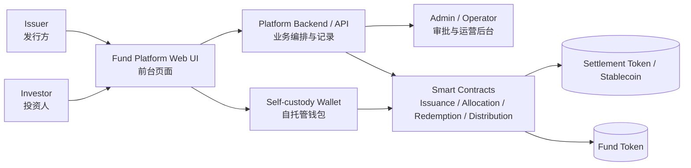
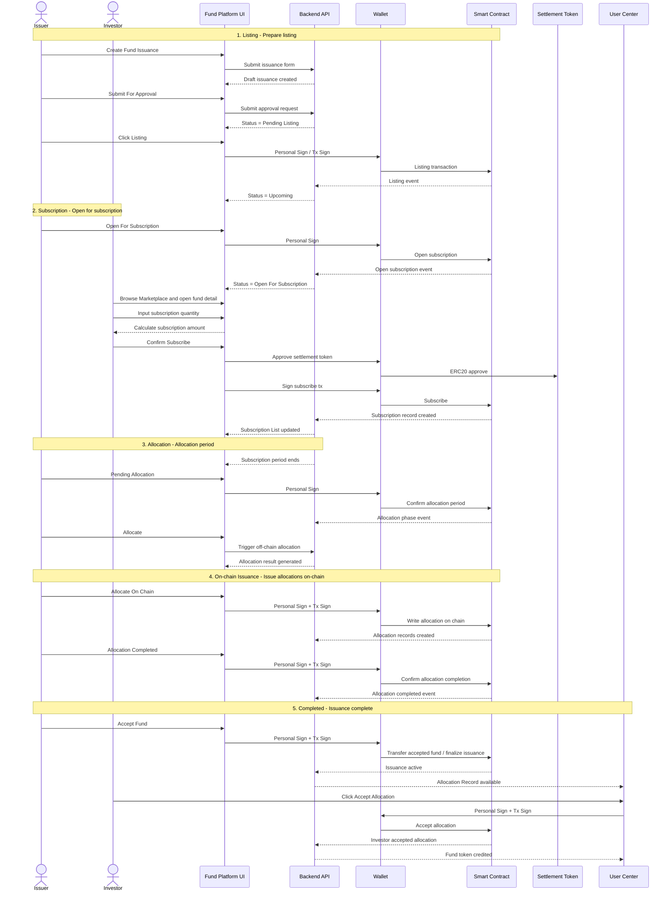
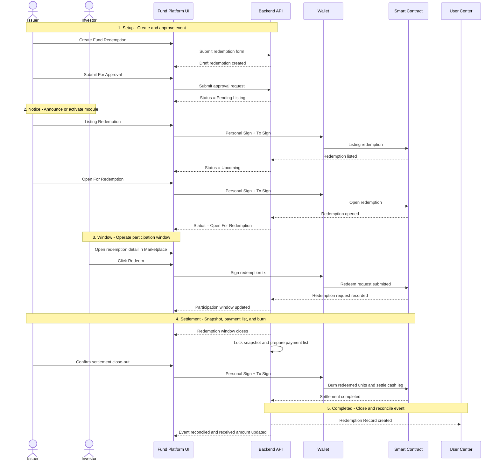
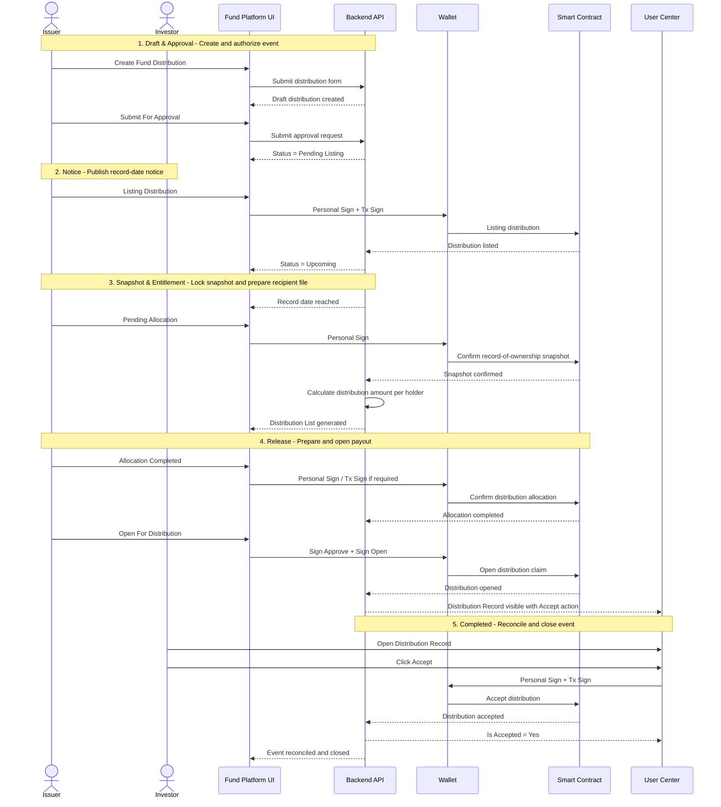

# 十七、Mermaid 对齐图

> 本节用于产品、设计、前端、后端、合约侧对齐，不替代正文需求；如图与正文冲突，以正文为准。

### 17.1 总体参与方与系统架构图

### 17.2 Fund Issuance / Subscription 时序图

### 17.3 Fund Redemption 时序图

### 17.4 Fund Distribution 时序图

### 17.5 推荐使用方式

- 产品对齐时，优先先看 `17.1`，确认参与方和责任边界。
- 前后端联调时，优先看 `17.2`、`17.3`、`17.4`，确认事件顺序、状态切换和签名点。
- 如后续需要，我可以继续补 `stateDiagram-v2` 版本，把三个流程的状态机也画成 Mermaid 图，方便直接贴进开发任务系统。
